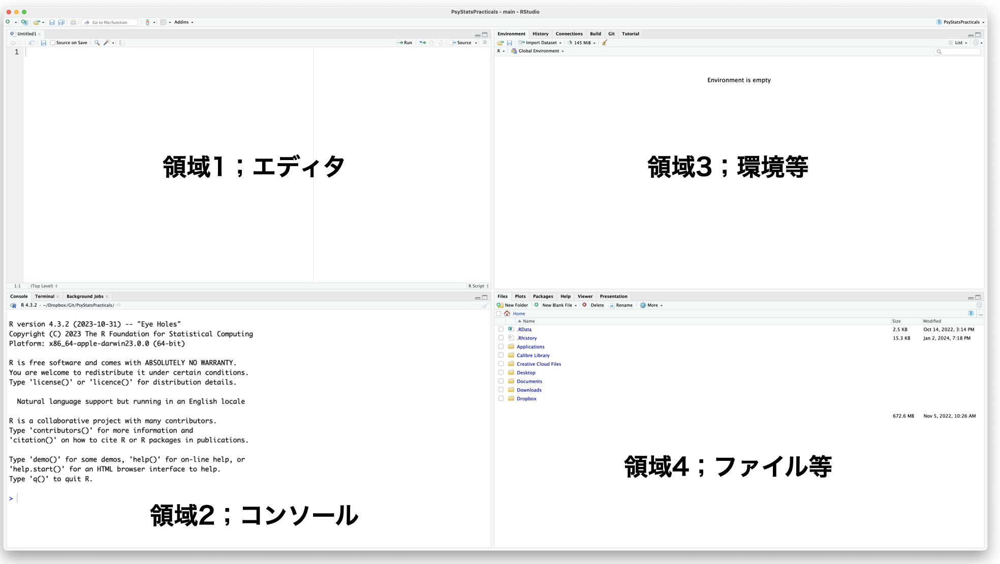
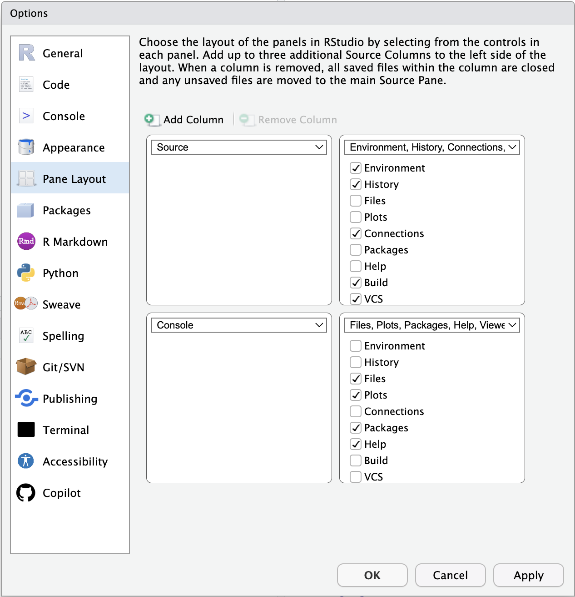

# Getting Started with R/RStudio

"R." The fact that this language is denoted by a single letter makes it remarkably difficult to search for, but R is a programming language specialised for statistics and is used extensively across the statistical sciences, psychology very much included. R is free software in the sense of *libre* as well as *gratis*: its source code is open, and anyone may use it without charge. "Free" here does not mean "without warranty in return for money," however. There is no guarantee — financial or otherwise — that the computations or scientific claims you produce with it are correct. Software, like science itself, is a shared resource of humanity that we cultivate openly.

R has an active user community. In Japan, Tokyo.R and similar local user groups host regular study meetings,[^1.1] and a wide range of introductory and advanced materials are available online. Because the ecosystem evolves quickly, the recommendations in this chapter are best supplemented with up-to-date searches for material close in time to your reading.

[^1.1]: As of January 2024, local user groups are active not only in Tokyo but in Fukuoka, Sapporo, Yamaguchi, Iruma, and elsewhere.

## Setting Up Your Environment

### Installing R

R is distributed via the [Comprehensive R Archive Network](https://cran.r-project.org/), known as CRAN.[^1.2] The CRAN front page provides download links; obtain the latest version for your platform.[^1.3]

[^1.2]: CRAN is variously pronounced "see-ran" or "kran."
[^1.3]: If you installed R for a course and return to it after more than six months, it is generally worth checking for a newer release, uninstalling the older version, and installing the latest. Some packages support only recent versions of R.

### Installing RStudio

After installing R, install RStudio. RStudio is an integrated development environment (IDE). R alone is fully capable of carrying out professional statistical analysis and graphics — its essence is, of course, computation, and given a script it returns the requested output. But day-to-day analytic work involves much more than the computation itself: drafting and revising scripts, managing input and output files and figures, installing and updating packages, and so on. To borrow a culinary analogy: even if cooking is fundamentally a matter of knife, board, and stove, a real kitchen with counter space, a sink, and bowls makes the work go more smoothly. Working in R alone is like cooking outdoors with a single pot; RStudio provides a full kitchen.

In principle, R alone suffices. If you prefer a minimal environment, that is a defensible choice. But this course assumes RStudio, which doubles as a capable text editor and document-preparation tool.[^1.4]

[^1.4]: R can also be driven from editors such as VS Code, or used as a kernel for Jupyter Notebook. Cloud-hosted environments such as [Google Colaboratory](https://colab.research.google.com/) can also run R. It is increasingly common to use such services in place of local installations.

### Resources for installation

A few up-to-date guides in English (as of 2025):

+ The official [CRAN documentation](https://cran.r-project.org/doc/manuals/r-release/R-admin.html)
+ Posit's [RStudio installation page](https://posit.co/download/rstudio-desktop/)
+ Wickham & Grolemund, [*R for Data Science*](https://r4ds.hadley.nz/), Chapter "Workflow: basics"
+ For macOS users, installation via [Homebrew](https://brew.sh/) (`brew install --cask r rstudio`) is convenient and recommended.

If neither of the bundled installers nor Homebrew suits your environment, a Web search for "install R RStudio" or asking a chat assistant such as ChatGPT will quickly turn up appropriate guides for any platform.

## RStudio Basics: the Four Panes

We assume R and RStudio are now installed. Launching RStudio reveals a window divided into four regions, known as **panes**. If Pane 1 (described below) appears to be missing, it is most likely collapsed; use the resize buttons at the top of the lower panes to restore it.

Pane layout is configurable from *Tools > Global Options > Pane Layout*. The default is a 2×2 grid, but you may rearrange the panes — and adjust the colour theme — to taste.

Each pane is summarised briefly below.

### Pane 1: Editor

The editor. This is where R scripts, report drafts, and most other input are written. *File > New File* shows the range of file types supported: not only R scripts but C, Python, Rmd, md, Qmd, HTML, Stan, SQL, and others. The file type currently in use is shown in the lower right of the pane.

Take an R script as the typical example. R is an interpreter, evaluating commands sequentially. Code written in the editor is sent to the console — and thus executed — by the *Run* button (top right). A single instruction is a *command*; the assembled sequence of commands is a *script* or *program*. To run several lines, select them in the editor and click *Run*; to run the entire script, click *Source* (next to *Run*). The keyboard shortcut for *Run* is Ctrl+Enter (Cmd+Enter on macOS).

### Pane 2: Console

If you were to use R without RStudio, this is essentially all you would see. The console is the R engine itself. The "`>`" symbol is the *prompt*; when the prompt is visible, R is awaiting input.

Because R evaluates sequentially, entering a command at the prompt produces an immediate result. You can type directly into the console, but doing so risks typos, and serious work tends to span multiple lines, so it is generally better to compose code in the editor and send it down. Use the console directly only for short, throwaway checks.

To clear the console, click the broom icon at the top right.

### Pane 3: Environment

This pane and Pane 4 usually contain several tabs each, and which tab lives where is configurable from *Pane Layout*. Two tabs warrant mention here.

The **Environment** tab shows the variables, functions, and other *objects* currently held in R's working memory. The GUI lets you inspect their contents and structure.

The **History** tab records the sequence of commands sent to the console. Commands can be re-sent to either the editor or the console from here, which is useful when you want to repeat something done a few minutes ago.

### Pane 4: Files

Again, only the central tabs are covered here.

The **Files** tab is a file manager analogous to Finder on macOS or Explorer on Windows: it supports creating folders, deleting, renaming, and copying files.

The **Plots** tab displays the output of plotting commands. One advantage of RStudio is that plots can be exported from this tab to file in a chosen format and size.

The **Packages** tab lists packages currently loaded and packages installed but not loaded. New packages can be installed from the *Install* button, and installed packages can be updated from here.

The **Help** tab displays output from R's help system (the `help()` function), giving function arguments, return values, and worked examples.

### Other tabs

A few additional tabs, whose visibility is configurable:

**Connections** is used to attach R to external databases. When working with data too large to fit in local memory, querying with SQL and retrieving only the necessary tables is essential.

**Git** integrates version control with the project (see below). Git was developed for collaborative software development but is equally useful for managing analytic notebooks and reports.

**Build** is used when building R packages or websites. This very textbook is produced with RStudio, and the *Build* tab plays a central role in rendering it from source.

**Tutorial** provides interactive tutorial tours.

**Viewer** displays HTML or PDF output generated within RStudio.

**Presentation** displays slide output generated within RStudio.

**Terminal** provides access to the system shell (Terminal on macOS, equivalent on Linux, PowerShell or similar on Windows) — useful for OS-level commands beyond R.

**Background Jobs** runs scripts asynchronously. R is single-threaded by default; this tab lets you run additional scripts in the background while continuing to work interactively.

## R Packages

R alone is sufficient for fundamental procedures such as linear models, but more advanced statistical methods are typically delivered through **packages**, that is, collections of functions distributed via CRAN or GitHub. The CRAN repository alone currently hosts 23,512 packages,[^1.5] and many additional packages live only on GitHub.[^1.6]

[^1.5]: As of 2 April 2026.
[^1.6]: Git is a distributed version-control system; GitHub hosts Git repositories on the Web. RStudio integrates with GitHub, so an RStudio project can be tied to a GitHub repository and put under version control with minimal ceremony. Many R developers also publish packages on GitHub, which has the advantage of bypassing CRAN's review queue when rapid iteration is required.

A package must be installed locally before first use; thereafter it is loaded into each R session with `library()`. Installation is a one-time operation per machine and version; loading is per session.

Installation can be done by R command, but the *Packages* pane in RStudio is the simplest entry point. A few widely used and broadly useful packages are listed below. Several appear in later chapters, so installing them in advance is recommended.

+ ***tidyverse*** [@tidyverse]: arguably the most important development in modern R. The tidyverse — created chiefly by Hadley Wickham — is a "package of packages" centred on a consistent grammar for data manipulation and visualisation. Rather than offering statistical models, it supplies a vocabulary for the **data wrangling** that precedes any model.[^1.7] Installing the tidyverse pulls in many dependencies and can take some time.
+ ***psych*** [@psych]: As the name suggests, this package collects a wide range of methods relevant to psychological statistics — specialised correlation coefficients, factor analysis routines, and so on. Essential.
+ ***GPArotation*** [@GPArotation]: factor rotation in factor analysis.
+ ***styler***: an automatic formatter for R code. Useful for tidying up scripts before circulation.
+ ***lavaan*** [@lavaan]: latent-variable modelling — *LAtent VAriable ANalysis* — i.e., structural equation modelling (SEM), also known as covariance structure analysis.
+ ***ctv*** [@CTV]: short for *CRAN Task Views*. Given the size of CRAN, finding the right package is a problem in itself; CTV organises packages by topic. After installing it, `install.views("Psychometrics")` will install a curated bundle of psychometric packages.
+ ***cmdstanr*** [@cmdstanr]: an R interface to the probabilistic programming language Stan, used for advanced Bayesian modelling. Installation requires Stan itself and a working C++ toolchain in addition to the R package; see the [official installation guide](https://mc-stan.org/cmdstanr/articles/cmdstanr.html).
+ ***pacman*** [@pacman]: a package manager. Packages are normally loaded with `library()` and, if not yet installed, must first be installed with `install.packages()`. Loading several packages at once also requires repeated `library()` calls. `pacman::p_load()` installs a package if missing and then loads it, and accepts multiple package names as in `p_load(A, B, C)`. This textbook uses `pacman::p_load()` throughout, so please install `pacman` first.

[^1.7]: In practice, most of the time in a real analysis is spent reshaping data into a form suitable for modelling. How adeptly, quickly, and intuitively this **data wrangling** can be done has a strong impact on subsequent steps. Specialised reference works on the topic, such as @Kinosady2021, attest to the importance the community attaches to it.

## RStudio Projects

A final piece of setup before getting to actual analysis: RStudio projects.

When working with documents on a computer, one typically organises files into folders — *Documents > Psychology > Exercises in Psychological Statistics*, for instance. Without this hierarchy, files become scattered and one ends up searching the disk every time a particular file is needed.

R analyses are no different. A single project may comprise scripts, data, image files, and report documents, and is typically organised into one folder per topic ("course," "thesis," and so on).

There is also the notion of a **working directory**.[^1.8] When R/RStudio is running, the working directory is "where R is right now" — the folder R treats as its base. If a file `sample.csv` lives in the working directory and a script needs to load it, the bare filename suffices; if the file lives elsewhere, the script must address it either by *relative path* (relative to the working directory) or by *absolute path* (from the filesystem root). The relative-vs-absolute distinction is the difference between "take the second right from here" and giving a full street address.

Where the working directory points at any given moment is a constant concern. Note in particular that the working directory is **not** necessarily the folder currently shown in the *Files* pane: opening a folder in the GUI does not change R's working directory.

This is what RStudio projects are for. A project bundles the working directory and environment settings together. Begin a new project from *File > New Project*; reopen an existing one from *File > Open Project* by selecting the `.proj` file. Opening a project sets the working directory accordingly. Tying a project to Git additionally gives folder-level version control.

In the rest of this textbook, when external files are referenced, we assume they live in the current project folder (i.e., paths are not specified).

[^1.8]: Here, "folder" and "directory" can be treated as synonyms. Command-line conventions prefer "directory"; GUIs prefer "folder." The Latin root of "directory" emphasises the *pointer* to a location; "folder" emphasises the container of files. "Folder" is the friendlier word.

## Exercises

+ Download the latest version of R from CRAN and install it on your machine.
+ Download RStudio Desktop from [Posit](https://posit.co/download/rstudio-desktop/) and install it.
+ Launch RStudio and rearrange the pane layout away from the default. A three-column layout for the source pane is one option worth trying.
+ Clear all output in the console pane.
+ Open the *Files* tab and explore various folders, deleting unneeded files and renaming files where appropriate.
+ In the *Files* tab, choose *More > Go To Working Directory*. What happened?
+ Create a new project for this course. The project may live in a new folder or an existing one.
+ When the project is open, look for the project name displayed somewhere in the RStudio window or tab bar. Confirm it.
+ Perform some file operations in the *Files* tab and then run *Go To Working Directory* again. Success means you have returned to the project folder.
+ Open a new R script file. Without writing anything, save it under a name of your choice.
+ Minimise or quit RStudio, then navigate to the project folder via the operating system's file manager. Confirm that the file you just created is there.
+ Inside the project folder, locate the file named `<project>.proj`. Open it to reopen the project in RStudio.
+ Close the project from *File > Close Project*. Note what changes in the RStudio window.
+ Quit RStudio and restart it. Reopen the project, either by double-clicking the `.proj` file or by launching the application and opening the project from the menu. Confirm that the project is open.
