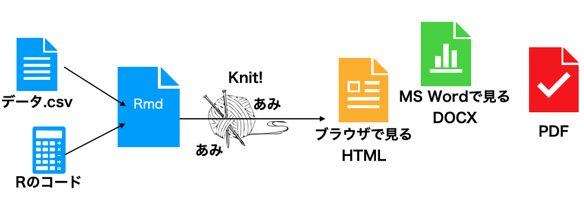
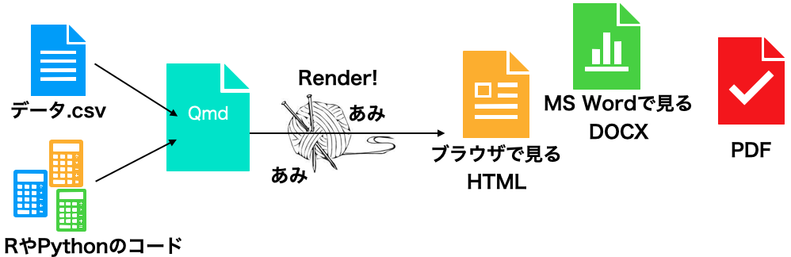
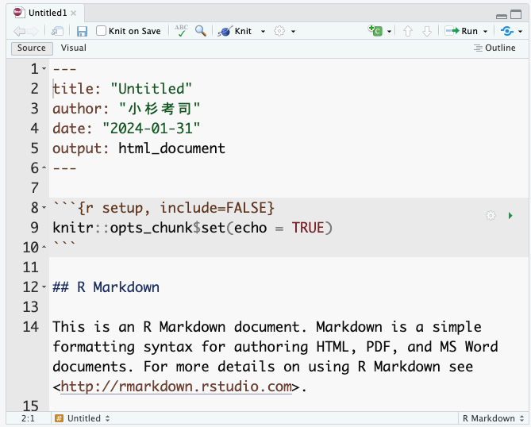
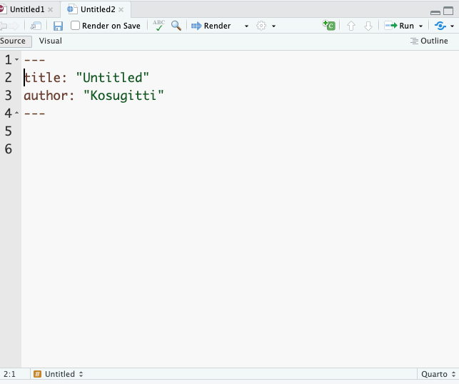
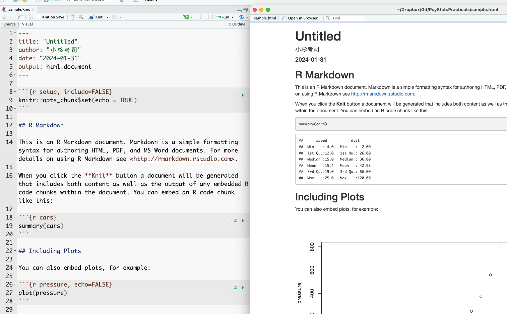

# Authoring Reports in R

```{r}
#| echo: FALSE
#| include: FALSE
pacman::p_load(tidyverse)
```
## Working with Rmd and Quarto

### Overview

This chapter covers document authoring in RStudio. Until now you have probably written documents in a word processor such as Microsoft Word, and used different applications for different tasks: R (or other software) for statistics, Excel for figures and tables. Such workflows repeatedly copy and paste numbers from one application to another. Each transfer is an opportunity for a transcription error, and any such error means the final document is wrong. This kind of error is sometimes called **"copy-paste contamination."**

The root cause is that the work spans multiple applications. If computation, plotting, and prose are all handled within a single environment, the problem disappears. **R Markdown** and **Quarto** are notations — and supporting software — that provide exactly this unified environment.

Markdown is one of several **markup languages**: a format in which special symbols are embedded in plain text, and a renderer turns the marked-up text into formatted output. Well-known markup languages include LaTeX (for mathematics) and HTML (for the Web). Markdown is a lightweight markup language designed to be easy to write and easy to read, even before rendering, and editable in any plain-text editor.

R Markdown extends Markdown by adding commands that embed R code and its results inside the document. R is used for computation and plotting; markup specifies where the results should appear. To view the final document, the source must be **compiled** ("knitted" in R Markdown parlance, "rendered" in Quarto's), and R is executed during compilation. Each compile re-runs the code, so a document that uses random numbers will refresh, and a document that reads an input file will reflect the latest contents. Crucially, copy-paste errors are eliminated and the same code reliably produces the same output document, which supports reproducibility. For a thorough treatment of reproducible document authoring, see @Takahashi201805.

Quarto is a successor that generalises R Markdown. It is one of Posit's flagship products. Whereas R Markdown is tied to R, Quarto natively supports Python and Julia in addition to R, and even allows multiple languages within a single document — one section in R, another verifying the result in Python, and a third rendering the figure in Julia.

This very textbook is produced with Quarto. Quarto can also build slide presentations and Web sites, and can output to HTML, PDF, or EPUB (e-book). This textbook is published in HTML, [PDF](心理学統計実習.PDF), and [EPUB](心理学統計実習.epub). A definitive print reference does not yet exist, but the [official documentation](https://quarto.org/) is excellent and should be consulted first.


### Creating a file and knitting

R Markdown is well integrated with RStudio: *File > New File > R Markdown* opens a dialog where you can set the title, author, date, and output format, and produces a sample file with placeholder content.





Quarto is similar: *File > New File > Quarto Document*. R Markdown files conventionally use the `.Rmd` extension, while Quarto files use `.qmd`. Quarto is also designed to be used outside RStudio: you can write `.qmd` files in a general-purpose editor such as VS Code and compile them from the command line.





In both formats, the top of the file is enclosed by four hyphens, forming the **YAML header**. (YAML stands for "Yet Another Markup Language" — denoting that this header region is not yet the markup body.) The YAML header configures document-wide settings such as title, author, and output format. YAML is sensitive to indentation, and a single malformed line will often prevent the document from compiling, so edit it with care. That said, mastery of the YAML header opens up many advanced customisations, so do experiment when you have time.

At the top of an Rmd or Qmd file in RStudio, you will see a *Knit* or *Render* button. Clicking it compiles the source into the rendered output.[^4.1] Because the sample document already contains working code, you should get an HTML document populated with text, code, and output. Try knitting the sample once and compare the source to the result.

[^4.1]: If the file has not been saved (it is still "Untitled"), a save dialog appears first. On the first compile in a fresh environment, RStudio may also prompt to install the supporting packages.




The correspondence between source and output is largely intuitive. The YAML title, author, and date appear at the top of the rendered document; lines beginning with `#` become headings.

The grey blocks delimited by triple backticks in the source are particularly important: these are **chunks**. R code inside a chunk is executed during compilation and the output is inserted into the document. For instance, the source contains a chunk with `summary(cars)`, and the rendered output shows the resulting summary of the built-in `cars` dataset. Note that the source file contains only the *instruction* — the result is generated automatically. This is the key point: there is no opportunity for copy-paste error, and given the same source and the same data, the document can be reproduced on any other machine. Unifying the environment thereby supports both error prevention and reproducibility.

The `cars` example uses a built-in dataset, so every reader gets the same output. For custom data the same principle applies: the same source plus the same data file plus the same processing steps yield the same output in any environment. One caveat: compilation runs in a fresh R session, so **objects that are not defined in the source cannot be used**. This is by design — relying on "data that I happened to pre-process beforehand" would defeat reproducibility, because no third party could verify the preprocessing. To take advantage of the share-the-source guarantee, all preprocessing (including data wrangling) must be written into chunks in the source file. This is sometimes inconvenient but is essential to good scientific practice.[^4.2]

[^4.2]: Strictly speaking, even this is not bulletproof: differences in R or package versions can produce different numerical results. The same packaging idea is therefore taken one step further by tools that ship the entire computing environment alongside the source. **Docker** is a well-known example of such an "environment in a box" system.

RStudio offers many editing aids for Rmd/Qmd files — visual mode, outline view, chunk-insert and chunk-run buttons, per-chunk settings, and so on. @Takahashi201805 is a good reference.

### Markdown syntax

The remainder of this section covers basic Markdown notation.

#### Headings and emphasis

As shown above, headings are introduced with `#`. The number of `#`s sets the level: a single `#` is the top level (a "chapter," HTML `<h1>`); `##` is a section (HTML `<h2>`); `###` is a subsection (`<h3>`); `####` is a sub-subsection (`<h4>`); and so on. A space between the `#`(s) and the heading text is required.

You will already be familiar with "paragraph writing" in the natural sciences, where a paper is decomposed hierarchically into sections, subsections, paragraphs, and sentences, with each level containing about four units of the next level down — and where a psychology paper is structured around four sections: Introduction, Methods, Results, and Discussion. Markdown encourages exactly this outline-driven style.

To emphasise text in place, use one asterisk for *italics* or two for **boldface**.

#### Tables, figures, and links

Tables in Markdown use vertical bars `|` and hyphens `-`:

```
| Header 1 | Header 2 | Header 3 |
| -------- | -------- | -------- |
| Row 1    | Data 1   | Data 2   |
| Row 2    | Data 3   | Data 4   |
```

Some R packages can output statistical results directly in Markdown table syntax, and AI assistants such as ChatGPT will happily convert a spreadsheet to Markdown on request.

Figures are inserted as links to image files. The bracketed text is the caption; the parenthesised text is the path to the image:

```

```

Web links use the same shape: `[displayed text](URL)`.

#### Lists

Bulleted lists are introduced with `+` or `-`. A blank line is required before and after the list:

```
preceding paragraph

+  list item 1
+  list item 2
+  list item 3
    - sub item 1
    - sub item 2

following paragraph
```

#### Chunks

As noted above, **chunks** contain executable code. A chunk begins with three backticks and a language specifier — for instance, `r` for R; `julia` or `python` for other engines.

It is a good idea to give the chunk a name. In the example below the chunk is named `chunksample`. Named chunks become navigable as outline entries within RStudio:

\```{r chunksample, echo = FALSE}<BR>
summary(cars)<BR>
\```<BR>

Chunk options follow the language specifier. `echo = FALSE` suppresses the display of the source code while still showing the output; many other options are available (omit output, run silently, etc.).

Quarto also supports an alternative syntax for chunk options:

\```{r}<BR>
\#| echo: FALSE<BR>
\#| include: FALSE<BR>
summary(cars)<BR>
\```<BR>

## Basic plotting

For reproducibility, figures should also be specified by code. **Always visualise your data first.** Visualisation reveals patterns and relationships that summary statistics alone can hide. After collecting data, the first step should be visualisation — and we emphasise this because it bears emphasising. For an extended treatment, drawing on examples from psychology, see @Kieran2018.

R's base graphics are perfectly adequate. The `plot()` function, given x and y vectors, immediately produces a scatter plot.

```{r RplotSample}
plot(iris$Sepal.Length, iris$Sepal.Width,
  main = "Example of Scatter Plot",
  xlab = "Sepal.Length",
  ylab = "Sepal.Width"
)
```

Optional arguments set the title, axis labels, point shape, colour, background, and so on. Base graphics handle the standard cases without any additional package.

## Plotting with ggplot

Now we turn to `ggplot2`, the visualisation package included in the tidyverse. Base graphics are powerful, but `ggplot2` produces more polished figures and is more intuitive to compose: the "gg" stands for **"the Grammar of Graphics"**, and the package indeed exposes a logical grammar for constructing plots. Scripts written in this grammar are readable and visually pleasing, which is one reason `ggplot2` figures are so widespread in the literature.

A key concept in `ggplot2` is the **layer**. A plot is built as a stack of layers: a base canvas; one or more geometric objects (points, lines, bars); aesthetic mappings (colour, shape, size); legends and captions. A *theme* unifies the visual style — colour palette, fonts, gridlines — and produces something publication-ready almost out of the box.

Here is a sample using the built-in `mtcars` dataset:

```{r, ggplotSample1}
#| dev: "ragg_png"

pacman::p_load(ggplot2)

ggplot(data = mtcars, aes(x = wt, y = mpg)) +
  geom_point() +
  geom_smooth(method = "lm", formula = "y ~ x") +
  labs(title = "Weight versus fuel economy", x = "Weight", y = "MPG")
```

First admire the finished product and the shape of the code that produced it. The opening `pacman::p_load(ggplot2)` loads the package; since `tidyverse` already includes `ggplot2`, getting into the habit of `pacman::p_load(tidyverse)` at the top of every script eliminates this line.

The `ggplot()` call spans four lines connected by `+`. Each `+` adds a layer to the plot, beginning with a blank canvas and accumulating elements.

Here is the canvas in isolation:

```{r, canvasOnly}
g <- ggplot()
print(g)
```

A plain empty canvas — to which we will subsequently add layers.

## Geometric objects (`geom_*`)

A *geometric object* (or **geom**) specifies how data should be visualised. `ggplot2` provides many varieties; a sampling:

- **`geom_point()`** — scatter plots, plotting each observation as a point.
- **`geom_line()`** — line plots, connecting points; commonly used for time series.
- **`geom_bar()`** — bar charts representing per-category quantities. Useful for counts and sums.
- **`geom_histogram()`** — histograms of continuous data.
- **`geom_boxplot()`** — box-and-whisker plots summarising a distribution (median, quartiles, outliers).
- **`geom_smooth()`** — a smoothing curve overlaid on the data; useful for trends. Options include linear regression and various smoothers.

Each geom is paired with a dataset and an aesthetic mapping. Here is a scatter plot via `geom_point()`:

```{r, geom_exam}
ggplot() +
  geom_point(data = mtcars, mapping = aes(x = disp, y = wt))
```

The first line constructs an empty canvas; `geom_point()` then adds points. The data are `mtcars`, with `disp` mapped to the x-axis and `wt` to the y-axis. The mapping function `aes()` (for **aesthetic mapping**) specifies which data values map to which graphical properties (x position, y position, colour, size, transparency, and so on).

Layers stack:

```{r, geom_overlay}
g <- ggplot()
g1 <- g + geom_point(data = mtcars, mapping = aes(x = disp, y = wt))
g2 <- g1 + geom_line(data = mtcars, mapping = aes(x = disp, y = wt))
print(g2)
```

We have introduced intermediate objects `g`, `g1`, `g2` to emphasise the layering; in practice, the whole chain is usually written as a single expression. Here both geoms share the same data and mapping; when several geoms share their data and aesthetics, it is cleaner to declare them at the canvas level:

```{r,default_aes}
#| eval: FALSE
ggplot(data = mtcars, mapping = aes(x = disp, y = wt)) +
  geom_point() +
  geom_line()
```

Since the first argument of `ggplot()` is the dataset, it can also be supplied via the pipe:

```{r,default_aes2}
#| eval: FALSE
mtcars %>%
  ggplot(mapping = aes(x = disp, y = wt)) +
  geom_point() +
  geom_line()
```

This makes the script read like a recipe: take the raw data, wrangle it into the form you want, and pass it on to be plotted. With practice you will start to imagine the target plot first — its axes, the geoms layered on top — and then write the data wrangling needed to deliver the relevant variables to `ggplot()`. Reverse-engineering a target plot into its ingredients and procedure is much like reading a recipe and deducing what ingredients to gather and in what order to do which step. AI assistants can be helpful for actually drafting the code, but it pays to set the goal and the overall design intent first and refine from there.

The example below combines wrangling with plotting. Each step is annotated; read it through and match the script against the rendered output.

```{r, withHandlingGGplot}
# work with the mtcars dataset
mtcars %>%
  # select the variables of interest
  select(mpg, cyl, wt, am) %>%
  mutate(
    # convert am and cyl to factors
    am = factor(am, labels = c("automatic", "manual")),
    cyl = factor(cyl)
  ) %>%
  # group by each level combination
  group_by(am, cyl) %>%
  summarise(
    M = mean(mpg), # mean fuel economy per group
    SD = sd(mpg), # standard deviation per group
    .groups = "drop" # drop grouping after summarise
  ) %>%
  # x = transmission, y = mean MPG, fill = cyl
  ggplot(aes(x = am, y = M, fill = cyl)) +
  # side-by-side bar chart
  geom_bar(stat = "identity", position = "dodge") +
  # ±1 SD error bars
  geom_errorbar(
    aes(ymin = M - SD, ymax = M + SD),
    position = position_dodge(width = 0.9),
    width = 0.25
  )
```

To repeat: code like this is not something one writes from scratch on the first try. What matters is to **picture the output**, to **decompose it into elements**, and to **lay those elements out as a procedure**.[^4.3]

[^4.3]: The code above was in fact generated by asking ChatGPT (GPT-4); rather than trying to lay it all out at once, it works best to specify the picture and refine incrementally.

## Plotting tips

A few additional techniques. These are easy to find via Web search or AI assistants on demand, but it helps to know that they exist. For a fuller treatment, see Chapter 4 of @Kinosady2021.

### Composing multiple ggplot objects

Sometimes you want several plots together on one panel — for instance, splitting the `mtcars` scatter plot into separate panels for automatic and manual transmissions.

`facet_wrap()` splits by one variable, `facet_grid()` by two:

```{r, exampleFacetWrap}
#| dev: "ragg_png"
mtcars %>%
  # weight vs MPG scatter plot
  ggplot(aes(x = wt, y = mpg)) +
  geom_point() +
  # split by number of cylinders
  facet_wrap(~cyl, nrow = 2) +
  # add caption
  labs(caption = "Example of facet_wrap")
```

```{r, exampleFacetGrid}
#| dev: "ragg_png"
mtcars %>%
  ggplot(aes(x = wt, y = mpg)) +
  geom_point() +
  # split by cyl x gear
  facet_grid(cyl ~ gear) +
  # add caption
  labs(caption = "Example of facet_grid")
```

If you want to combine *different* plots into one figure, the `patchwork` package is convenient:

```{r, patchwork example}
pacman::p_load(patchwork)

# scatter plot
g1 <- ggplot(mtcars, aes(x = wt, y = mpg)) +
  geom_point() +
  ggtitle("Scatter Plot", "MPG vs Weight")

# bar chart
g2 <- ggplot(mtcars, aes(x = factor(cyl), y = mpg)) +
  geom_bar(stat = "identity") +
  ggtitle("Bar Chart", "Average MPG by Cylinder")

# combine with patchwork
combined_plot <- g1 + g2 +
  plot_annotation(
    title = "Combined Plots",
    subtitle = "Scatter and Bar Charts"
  )

print(combined_plot)
```
### Saving ggplot objects

Inside an Rmd or Quarto document, plots are saved automatically. To save a plot as a standalone file, use `ggsave()`:

```{r, ggsave}
#| eval: FALSE
# a scatter plot
p <- ggplot(mtcars, aes(x = wt, y = mpg)) +
  geom_point()
ggsave(
  filename = "my_plot.png", # output filename
  plot = p, # plot object to save
  device = "png", # output format
  path = "path/to/directory", # output directory
  scale = 1, # scaling factor
  width = 5, # width (inches)
  height = 5, # height (inches)
  dpi = 300, # resolution
)
```


### Changing themes (matching the report)

For a report or paper, you may need monochrome figures. `ggplot2` chooses a colour scheme automatically by selecting a default **palette**; changing the palette changes the colours used. For greyscale output, use the `Greys` palette.

```{r}
#| dev: "ragg_png"
# greyscale plot
p1 <- ggplot(mtcars, aes(x = wt, y = mpg, color = factor(cyl))) +
  geom_point(size = 3) +
  scale_fill_brewer(palette = "Greys") +
  ggtitle("Greys palette")

# load an additional palette package
pacman::p_load(RColorBrewer)
# colour-blind-friendly palette
p2 <- ggplot(mtcars, aes(x = wt, y = mpg, color = factor(cyl))) +
  geom_point(size = 3) +
  scale_color_brewer(palette = "Set2") +
  ggtitle("Colour-blind-friendly palette")

# display side by side
combined_plot <- p1 + p2 + plot_layout(ncol = 2)
print(combined_plot)
```

By default, `ggplot2` figures have a grey background, set by the default theme `theme_gray()`. The figure examples in the Japanese Psychological Association's [editorial guidelines](https://psych.or.jp/manual/) use a white background; for that look, switch to `theme_classic()` or `theme_bw()`.

```{r}
p2 + theme_classic()
```

Many other tweaks are possible. As long as you can decompose the target figure into its elements, almost any modification can be specified.

## Exercises

+ Today's exercises should be written in R Markdown. Include your student ID and name in the *author* field, add appropriate headings, and clearly mark the prose corresponding to each question, so that the chunk answering each question is unambiguous.

1. Read `Baseball.csv`, restrict to the 2020 season, perform any variable conversions needed for what follows, and store the result in `dat.tb`.
2. Draw a histogram of the height variable in `dat.tb`. Use `theme_classic()`.
3. Draw a scatter plot of height against weight. Use `theme_bw()`.
4. (Continued.) Colour the points by blood type. Use the `Set3` palette.
5. (Continued.) Use the point shape (not just colour) to encode blood type.
6. Make a height-vs-weight scatter plot, faceted by team.
7. (Continued.) Add a `geom_smooth()`. The `method` argument can be left at its default.
8. (Continued.) Now use `method = "lm"` for a linear fit.
9. Plot the means: x-axis height, y-axis the mean weight. Several approaches are possible — you could pre-compute a summary table `dat.tb2`, or use `geom_point(stat = "summary", fun = mean)` inside the geom.
10. Combine exercises 2, 4, and a weight histogram into the figure below, and save it with `ggsave()`. Filename and other options are up to you.

```{r}
#| dev: "ragg_png"
#| echo: FALSE

dat.tb <- read_csv("Baseball.csv", show_col_types = FALSE) %>%
  filter(Year == "2020年度") %>%
  as_tibble()
# histogram of height
p1 <- ggplot(dat.tb, aes(x = height)) +
  geom_histogram(binwidth = 1) +
  theme_classic() +
  ggtitle("Histogram of height")

# histogram of weight
p2 <- ggplot(dat.tb, aes(x = weight)) +
  geom_histogram(binwidth = 1) +
  theme_classic() +
  ggtitle("Histogram of weight")

# scatter plot coloured by blood type
p3 <- ggplot(dat.tb, aes(x = height, y = weight, color = bloodType)) +
  geom_point() +
  theme_bw() +
  scale_color_brewer(palette = "Set3") +
  ggtitle("Height vs weight")

# blank panel
p4 <- ggplot() +
  theme_void()

# arrange with patchwork
combined_plot <- (p1 | p3) / (p4 | p2)

print(combined_plot)
```
