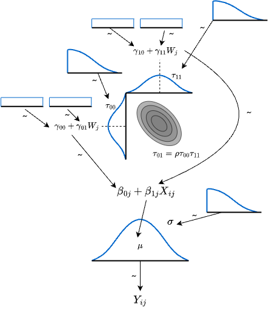

# Extensions of the Linear Model

This chapter develops the **linear model** — a model expressing the relationship between explanatory and response variables as a linear (first-order) function. The natural progression is from the general linear model (LM) to the generalised linear model (GLM), then to the generalised linear mixed model (GLMM), and finally to the hierarchical linear model (HLM). We begin with the general linear model.

## The general linear model

The foundation is regression. A simple regression is

$$
y_i = \beta_0 + \beta_1 x_i + e_i,
$$

where $y_i$ is the $i$-th observation, $\beta_0$ the intercept, $\beta_1$ the regression coefficient, and $e_i$ the error. The extension to multiple regression is

$$
y_i = \beta_0 + \beta_1 x_{1i} + \beta_2 x_{2i} + \cdots + \beta_p x_{pi} + e_i,
$$

with predictors $x_1, \ldots, x_p$ and coefficients $\beta_1, \ldots, \beta_p$.

In vector/matrix form,

$$
y = X\beta + e,
$$

where $y$ is an $n$-vector, $X$ is the $n \times p$ **design matrix**, $\beta$ is a $p$-vector, and $e$ is an $n$-vector.

The design matrix stacks the explanatory-variable data:

$$
X = \begin{pmatrix}
1 & x_{11} & x_{12} & \cdots & x_{1p}\\
1 & x_{21} & x_{22} & \cdots & x_{2p}\\
\vdots & \vdots & \vdots & \ddots & \vdots\\
1 & x_{n1} & x_{n2} & \cdots & x_{np}
\end{pmatrix}.
$$

The first column is the constant 1 carrying the intercept; the remaining columns carry the predictors. The coefficient vector $\beta = (\beta_0, \beta_1, \ldots, \beta_p)^T$ then multiplies in to produce the linear combinations.

When a predictor $x$ takes only the values 0 and 1, it is a **dummy variable**. With a dummy predictor, the scatter plot looks unusual: only two values along the x-axis.

```{r image_glm}
#| dev: "ragg_png"
#| echo: false
#| message: false
pacman::p_load(tidyverse, patchwork)

# dummy data for simple regression
set.seed(123)
n <- 30
x <- rnorm(n, mean = 5, sd = 2)
y <- 10 + 2 * x + rnorm(n, sd = 3)

df_regression <- data.frame(x = x, y = y)

p1 <- ggplot(df_regression, aes(x = x, y = y)) +
  geom_point(alpha = 0.7, size = 2) +
  geom_smooth(method = "lm", se = FALSE, color = "blue") +
  theme_minimal() +
  labs(x = "predictor", y = "response", title = "Continuous data")

# two-group data
set.seed(17)
N <- 30
x1 <- rnorm(N, mean = 1)
x2 <- rnorm(N)

df_exp <- data.frame(
  group = factor(rep(c("Control", "Experimental"), each = N),
                 levels = c("Control", "Experimental")),
  value = c(x2, x1)
)

p2 <- ggplot(df_exp, aes(x = group, y = value)) +
  geom_point(alpha = 0.6) +
  geom_segment(
    data = df_exp %>% group_by(group) %>% summarise(mean_value = mean(value)),
    aes(
      x = as.numeric(group) - 0.1, xend = as.numeric(group) + 0.1,
      y = mean_value, yend = mean_value
    ),
    color = "gray", linewidth = 1
  ) +
  geom_segment(
    x = 0.5, xend = 2.5,
    y = mean(df_exp$value[df_exp$group == "Control"]) - 0.65,
    yend = mean(df_exp$value[df_exp$group == "Experimental"]) + 0.65,
    color = "blue", linewidth = 1
  ) +
  theme_minimal() +
  labs(x = "group", y = "response", title = "Dummy-coded data")

p3 <- ggplot(df_exp, aes(x = group, y = value)) +
  geom_point(alpha = 0.6) +
  geom_segment(
    data = df_exp %>% group_by(group) %>% summarise(mean_value = mean(value)),
    aes(
      x = as.numeric(group) - 0.1, xend = as.numeric(group) + 0.1,
      y = mean_value, yend = mean_value
    ),
    color = "gray", linewidth = 1
  ) +
  geom_hline(yintercept = mean(df_exp$value), linetype = "dashed",
             color = "blue", linewidth = 1) +
  theme_minimal() +
  labs(x = "group", y = "response", title = "Null hypothesis")

p4 <- p1 + p2
plot(p4)
```

Fitting a regression line through this kind of plot produces a line through the two group means. Regression assumes errors normally distributed about $\hat{y}$; for dummy-coded data this becomes "errors normally distributed about each group mean" — the very assumption of the two-sample $t$-test. The $t$-test for a mean difference and a regression with a nominal-scale predictor are thus mathematically the same. The unifying name is the **general linear model**.

## The generalised linear model (GLM)

For a long time psychology relied on factorial designs analysed by NHST, designs engineered to fit a test of means, with the verdict determined by a $p$-value. NHST was thought to be independent of the data-generating mechanism, accessible to anyone with statistical software, and decidable by an "uncontaminated" number.

Setting aside the wider critique of that paradigm, the dominant practice was to reduce everything to a test of differences of normal means. Hence proportions, counts, and other data ill-suited to a normal model were forced into normality by log or angular transformations and then tested.

The normal distribution stretches over $(-\infty, +\infty)$, but proportions lie in $[0, 1]$ and counts in the non-negative integers; forcing a general linear model on such data is a serious violation of its assumptions.[^1]

[^1]: To offer an excuse: the statistical and computing toolkit of that era was much thinner than today's, and even when theoretical impropriety was acknowledged, there was little users could do about it. Psychology also measures only rough surrogates for invisible mental quantities, and there is a folk argument that, given the more fundamental problems with the data themselves, statistical-assumption violations are a minor matter. That climate may be part of how the practice persisted.

In response, statistical models built on distributions other than the normal were developed. These are the **generalised linear models (GLMs)**.[^2]

[^2]: In English, "general linear model" vs. "generalised linear model" differs by *-ised*; that one-letter difference is easier to track than the analogous Japanese pair (一般 vs. 一般化), so we use the English distinction.

Most probability distributions have a location parameter and a scale parameter. A statistical model addresses the average behaviour, so we want the linear part to map to the location parameter — after a suitable algebraic rearrangement. We illustrate with the Bernoulli and Poisson families.

### A linear model for the Bernoulli: logistic regression

The Bernoulli distribution models binary outcomes such as heads/tails. Its probability mass function is

$$
P(Y = y) = p^y (1 - p)^{1 - y},
$$

with success probability $p \in [0, 1]$. Such data abound in practice — life vs. death, presence vs. absence of disease, correct vs. incorrect on a test. Running an ordinary linear regression on a binary outcome gives nonsensical predictions outside $[0, 1]$.

The fix is a **link function** that maps the linear predictor to a probability appropriately. For logistic regression the link is the **logit**:

$$
\text{logit}(p) = \log\left(\frac{p}{1 - p}\right) = \beta_0 + \beta_1 x.
$$

Solve for $p$. Let $\eta = \beta_0 + \beta_1 x$:

$$
\log\left(\frac{p}{1 - p}\right) = \eta.
$$

Exponentiate:

$$
\frac{p}{1 - p} = e^{\eta}.
$$

Multiply by $(1 - p)$:

$$
p = (1 - p) e^{\eta}.
$$

Expand:

$$
p = e^{\eta} - p e^{\eta}.
$$

Gather $p$:

$$
p + p e^{\eta} = e^{\eta},
$$

$$
p(1 + e^{\eta}) = e^{\eta},
$$

$$
p = \frac{e^{\eta}}{1 + e^{\eta}}.
$$

Divide numerator and denominator by $e^{\eta}$:

$$
p = \frac{1}{e^{-\eta} + 1} = \frac{1}{1 + e^{-\eta}}.
$$

Substituting $\eta = \beta_0 + \beta_1 x$ gives the **logistic function** (the inverse link):

$$
p = \frac{1}{1 + e^{-(\beta_0 + \beta_1 x)}}.
$$

The Bernoulli model then becomes

$$ y \sim \text{Bernoulli}(p). $$

Simulate some data and compare a linear and a logistic fit:

```{r logistic_curve}
#| dev: "ragg_png"
#| message: false
pacman::p_load(tidyverse, patchwork)

# generate data
set.seed(17)
n <- 200
x <- runif(n, min = -10, max = 10)
beta_0 <- 1
beta_1 <- 2
p <- beta_0 + x * beta_1
prob <- 1 / (1 + exp(-p))
y <- rbinom(n, size = 1, prob = prob)

df_logistic <- data.frame(x = x, y = y)

# p1: ordinary linear regression
p1 <- ggplot(df_logistic, aes(x = x, y = y)) +
  geom_point(alpha = 0.7, size = 2) +
  geom_smooth(method = "lm", se = FALSE, color = "blue") +
  theme_minimal() +
  labs(x = "predictor", y = "response", title = "Linear regression")

# p2: logistic regression
p2 <- ggplot(df_logistic, aes(x = x, y = y)) +
  geom_point(alpha = 0.7, size = 2) +
  geom_smooth(method = "glm", method.args = list(family = "binomial"),
              se = FALSE, color = "red") +
  theme_minimal() +
  labs(x = "predictor", y = "response", title = "Logistic regression")

p1 + p2
```

The linear regression extrapolates predictions outside the valid range; the logistic regression fits cleanly.

To fit a logistic regression from data one can use `glm()`, but here we use the Bayesian `brms` interface. `brm()`'s formula syntax mirrors `glm()`'s; the only conceptual change is from MLE to Bayes.

```{r logistic_regression}
#| message: false
pacman::p_load(brms)
# fix brms's backend to cmdstanr (avoiding rstan)
options(brms.backend = "cmdstanr")
result.bayes.logistic <- brm(
  y ~ x,
  family = bernoulli(),
  data = df_logistic,
  seed = 12345,
  chains = 4, cores = 4, backend = "cmdstanr",
  iter = 2000, warmup = 1000,
  refresh = 0
)
summary(result.bayes.logistic)
plot(result.bayes.logistic)
## ML comparison
result.ml <- glm(y ~ x, family = binomial(), data = df_logistic)
summary(result.ml)
```

The MLE and Bayesian estimates differ slightly because of the small sample size. With a binary outcome, the available variance is necessarily small, and accurate estimation requires more data.

Interpreting the coefficients also takes some care. In ordinary regression, a coefficient is "change in $y$ per unit change in $x$"; in logistic regression that direct interpretation does not work, because the logistic function intervenes.

The linear model expresses

$$ \beta_0 + \beta_1 x = \log \frac{p}{1 - p}. $$

The right-hand side $\log\{p/(1-p)\}$ is the **logit**. Logistic regression uses the logit to make the relationship linear. Conversely, the linear model captures the *log of the odds*, with the odds determined by the linear combination of predictors. To interpret a coefficient, exponentiate it and read the result as an odds ratio.

In our data the estimated slope is 1.36, so $e^{1.36} = 3.89$: a one-unit increase in the predictor multiplies the odds of success by 3.89.

### A linear model for the Poisson: Poisson regression

Now consider count data — non-negative integers — for which the Poisson is natural. The probability mass function is

$$
P(Y = y) = \frac{\lambda^y e^{-\lambda}}{y!},
$$

with $\lambda$ both the mean and the variance. The shape of the Poisson:

```{r poisson_curve}
#| dev: "ragg_png"
#| message: false
#| echo: false
pacman::p_load(tidyverse)

lambdas <- c(1, 2, 3, 5, 10, 20)
x_max <- 40

poisson_data <- expand_grid(
  lambda = lambdas,
  x = 0:x_max
) %>%
  mutate(
    prob = dpois(x, lambda),
    lambda_label = factor(paste("λ =", lambda), levels = paste("λ =", lambdas))
  )

ggplot(poisson_data, aes(x = factor(x), y = prob)) +
  geom_col(width = 0.7, fill = "steelblue", alpha = 0.7) +
  facet_wrap(~lambda_label, scales = "free", ncol = 3) +
  scale_x_discrete(breaks = function(x) x[seq(1, length(x), by = 2)]) +
  theme_classic() +
  labs(
    x = "value (k)",
    y = "probability P(X = k)",
    title = "Poisson probability mass function"
  ) +
  theme(
    strip.background = element_blank(),
    strip.text = element_text(size = 10)
  )
```

For non-negative-integer data, Poisson regression is preferred. The link is the **logarithm**:

$$
\log(\lambda_i) = \beta_0 + \beta_1 x_i,
$$

with inverse link the **exponential**:

$$ \lambda_i = \exp(\beta_0 + \beta_1 x_i), $$

and the model is

$$ y_i \sim \text{Poisson}(\lambda_i). $$

A simulated example:

```{r poisson_plot}
#| dev: "ragg_png"
#| message: false

# generate data
set.seed(17)
n <- 200
x <- runif(n, min = 0, max = 10)
beta_0 <- 0.5
beta_1 <- 0.3
lambda <- exp(beta_0 + beta_1 * x)
y <- rpois(n, lambda = lambda)

df_pois <- data.frame(x = x, y = y)

# p1: linear regression (inappropriate)
p1 <- ggplot(df_pois, aes(x = x, y = y)) +
  geom_point(alpha = 0.7, size = 2) +
  geom_smooth(method = "lm", se = FALSE, color = "blue") +
  theme_minimal() +
  labs(x = "predictor", y = "count", title = "Linear regression (inappropriate)")

# p2: Poisson regression (appropriate)
p2 <- ggplot(df_pois, aes(x = x, y = y)) +
  geom_point(alpha = 0.7, size = 2) +
  geom_smooth(method = "glm", method.args = list(family = "poisson"),
              se = FALSE, color = "red") +
  theme_minimal() +
  labs(x = "predictor", y = "count", title = "Poisson regression (appropriate)")

p1 + p2
```

Linear regression could produce negative predictions; Poisson regression, via the exponential link, respects the count-data property.

To fit:

```{r poisson_regression}
#| message: false
result.bayes.pois <- brm(
  y ~ x,
  family = poisson(),
  data = df_pois,
  seed = 12345,
  chains = 4, cores = 4, backend = "cmdstanr",
  iter = 2000, warmup = 1000,
  refresh = 0
)
summary(result.bayes.pois)
plot(result.bayes.pois)
## ML comparison
result.ml.pois <- glm(y ~ x, family = poisson(), data = df_pois)
summary(result.ml.pois)
```


## The generalised linear mixed model (GLMM)

A further extension is the **generalised linear mixed model (GLMM)**. Up to now the regression models we considered have assumed that a predictor exerts a uniform effect across all units. Those effects are called **fixed effects**. GLMMs add **random effects** to the model.

A random effect captures the idea that a predictor's effect varies across individuals. A within-subjects factorial design, for example, controls for individual differences; this can be cast as a model in which the variation of interest is the within-subjects main effect, while individual differences in average level are absorbed into a random intercept for each person.

We assume that these individual differences come from a probability distribution, typically normal. Individual differences arise as random draws, and individuals are taken to be exchangeable. The spread of those differences is the variance of the random effect. Since these individual-difference distributions are **mixed** into the model alongside the residual distribution, the model is called a **mixed** model.

### Mixing in individual-difference distributions

Compare the between- and within-subjects ANOVA decompositions. For one factor in a between-subjects design,
$$ SS_T = SS_A + SS_e, $$

with total sum of squares $SS_T$ split into the factor-A effect and the error. For a within-subjects design,

$$SS_T = SS_A + SS_s + SS_e,$$

with an additional individual-difference term $SS_s$. The test compares the effect to the error,[^3] so for the same effect a within-subjects design is more sensitive; in a between-subjects design the individual differences are mixed into the error and cannot be removed, whereas the within-subjects design isolates them.

[^3]: More precisely, the test statistic is the ratio of the mean squares (sum of squares divided by degrees of freedom).

At the level of individual observations, the between-subjects model is

$$ Y_{ij} = \beta_0 + \beta_1 x_{ij} + e_{ij}, $$

while the within-subjects model is

$$ Y_{ij} = \mu + \beta_{0i} + \beta_1 x_{ij} + e_{ij}, $$

with $\mu$ the grand mean and $\beta_{0i}$ the deviation of individual $i$'s mean from the grand mean — i.e., the individual difference. With repeated measures on each individual we can compute an individual mean and extract the relative intercept shift as that individual's effect.

Cast as random variables,
$$e_{ij} \sim N(0, \sigma_e),$$
$$\beta_{0i} \sim N(0, \sigma_s),$$

so two probability distributions are mixed into the model for each observation.

We have illustrated individual differences as variation in intercepts; one may equally consider variation in slopes. Depending on where the random effect lives, we speak of **random-intercept**, **random-slope**, or **random-intercept random-slope** models.

### Random-intercept model

In a random-intercept model the intercept varies across individuals. Treating the per-individual intercept as a random draw from a normal:

$$
\beta_{0i} = \beta_0 + u_{0i}, \quad u_{0i} \sim N(0, \sigma_u).
$$

The full model is

$$
y_{ij} = (\beta_0 + u_{0i}) + \beta_1 x_{ij} + e_{ij},
$$

with $e_{ij}$ the residual for individual $i$'s $j$-th observation.

A concrete example:

```{r random_intercept_model plot}
#| dev: "ragg_png"
#| message: false

set.seed(17)
n_person <- 10
n_obs <- 20
beta_0 <- 1
beta_1 <- 2
sigma_u <- 1
sigma_e <- 0.5

person_intercepts <- rnorm(n_person, mean = 0, sd = sigma_u)

df_random_intercept <- expand_grid(
  person = 1:n_person,
  obs = 1:n_obs
) %>%
  mutate(
    x = runif(n(), min = 0, max = 10),
    u_0 = person_intercepts[person],
    y = beta_0 + u_0 + beta_1 * x + rnorm(n(), mean = 0, sd = sigma_e),
    person_factor = factor(person)
  )

df_random_intercept %>% head()

# p1: ordinary linear regression (one line for all)
p1 <- ggplot(df_random_intercept, aes(x = x, y = y)) +
  geom_point(alpha = 0.5, size = 1) +
  geom_smooth(method = "lm", se = FALSE, color = "blue", linewidth = 1.2) +
  theme_minimal() +
  labs(x = "predictor", y = "response",
       title = "Linear regression (fixed effects only)")

# p2: random-intercept model (per-person intercepts)
p2 <- ggplot(df_random_intercept, aes(x = x, y = y, color = person_factor)) +
  geom_point(alpha = 0.6, size = 1) +
  geom_smooth(method = "lm", se = FALSE, linewidth = 0.8) +
  theme_minimal() +
  labs(x = "predictor", y = "response", title = "Random-intercept model") +
  theme(legend.position = "none")

p1 + p2
```

Estimation:

```{r random_intercept_model}
#| message: false
result.bayes.random_intercept <- brm(
  y ~ x + (1 | person),
  family = gaussian(),
  data = df_random_intercept,
  seed = 12345,
  chains = 4, cores = 4, backend = "cmdstanr",
  iter = 2000, warmup = 1000,
  refresh = 0
)
summary(result.bayes.random_intercept)
plot(result.bayes.random_intercept)

## ML comparison
pacman::p_load(lmerTest)
result.ml.random_intercept <- lmer(y ~ x + (1 | person), data = df_random_intercept)
summary(result.ml.random_intercept)

## also fit an ordinary regression for comparison
result.ml.random_intercept.ordinal <- lm(y ~ x, data = df_random_intercept)
summary(result.ml.random_intercept.ordinal)
```
```{r random_intercept_model coef}
#| message: false
#| echo: false
bayes_estimates <- fixef(result.bayes.random_intercept)
bayes_sigma_u <- VarCorr(result.bayes.random_intercept)$person$sd[1]
bayes_variances <- VarCorr(result.bayes.random_intercept)
bayes_sigma_u <- sqrt(bayes_variances$person$sd[1, 1]^2)
bayes_sigma_e <- bayes_variances$residual__$sd[1, 1]
ml_estimates <- fixef(result.ml.random_intercept)
ml_sigma_u <- as.data.frame(VarCorr(result.ml.random_intercept))$sdcor[1]
ml_sigma_e <- sigma(result.ml.random_intercept)
lm_estimates <- coef(result.ml.random_intercept.ordinal)
```

The random-effects notation `(1 | person)` says that intercepts vary by `person`. The `1` denotes the intercept, `person` the grouping variable.

The simulated SDs were $\sigma_u =$ `r sigma_u` and $\sigma_e =$ `r sigma_e`. Bayesian estimation returns `r round(bayes_sigma_u, 3)` and `r round(bayes_sigma_e, 3)` respectively; MLE returns `r round(ml_sigma_u, 3)` and `r round(ml_sigma_e, 3)`. Both methods land near the truth.

The fixed-effects-only regression returns an intercept of `r round(lm_estimates[1], 3)` and a slope of `r round(lm_estimates[2], 3)`. The slope is the same, but the intercept estimate differs because the model does not accommodate the variability across persons. The fixed-effects-only model estimates only the mean of the normal-distributed intercepts — analogous to analysing a within-subjects design as if it were between-subjects, throwing away the very individual differences that the within-subjects design isolates.

#### Per-individual estimates

A benefit of Bayesian estimation is that we can quantify per-individual estimates and their uncertainty. Below we extract the MCMC samples for each individual's random effect and visualise the posteriors.

`brms::ranef()` will do this directly, but extracting and shaping the MCMC samples ourselves is a useful exercise in understanding MCMC-based inference.

```{r individual_estimates}
#| dev: "ragg_png"
#| message: false

# per-individual random effects
random_effects <- ranef(result.bayes.random_intercept)
print(random_effects)
# extract the per-individual intercept posterior samples
posterior_samples <- as_draws_df(result.bayes.random_intercept) %>%
  select(starts_with("r_person")) %>%
  rowid_to_column("iter") %>%
  pivot_longer(-iter) %>%
  mutate(person = str_extract(name, pattern = "\\d+")) %>%
  mutate(person = factor(person, levels = as.character(1:10))) %>%
  select(-name)
# summary statistics from the MCMC samples
posterior_samples %>%
  group_by(person) %>%
  summarise(
    EAP = mean(value),
    median = quantile(value, 0.5),
    q025 = quantile(value, 0.025),
    q975 = quantile(value, 0.975),
    sd = sd(value),
    .groups = "drop"
  )

# posterior density plot
p1 <- ggplot(posterior_samples, aes(x = value, fill = person)) +
  geom_density(alpha = 0.7) +
  facet_wrap(~person, scales = "free_y") +
  theme_minimal() +
  labs(x = "intercept random effect", y = "posterior density",
       title = "Posterior distribution of per-individual intercept random effects") +
  theme(legend.position = "none")

print(p1)
```

The effect extracted here is the *deviation* from the grand intercept; the actual per-individual intercept is fixed effect + random effect. `coef()`, or further processing of the MCMC samples, gives the absolute per-individual intercepts.

```{r individual_total_effects}
#| dev: "ragg_png"
#| message: false
# per-individual total intercept (fixed + random)
individual_coefs <- coef(result.bayes.random_intercept)$person

total_intercept_samples <- as_draws_df(result.bayes.random_intercept) %>%
  select(b_Intercept, starts_with("r_person")) %>%
  rowid_to_column("iter") %>%
  pivot_longer(-c(iter, b_Intercept)) %>%
  mutate(person = str_extract(name, pattern = "\\d+")) %>%
  mutate(person = factor(person, levels = as.character(1:10))) %>%
  mutate(total_intercept = b_Intercept + value) %>%
  select(iter, person, total_intercept)

p2 <- ggplot(total_intercept_samples, aes(x = total_intercept, fill = person)) +
  geom_density(alpha = 0.7) +
  facet_wrap(~person, scales = "free_y") +
  theme_minimal() +
  labs(
    x = "absolute intercept (fixed + random)", y = "posterior density",
    title = "Posterior distribution of per-individual absolute intercepts"
  ) +
  theme(legend.position = "none")

print(p2)

# credible intervals for the absolute intercepts
total_intercept_summary <- total_intercept_samples %>%
  group_by(person) %>%
  summarise(
    EAP = mean(total_intercept),
    median = quantile(total_intercept, 0.5),
    q025 = quantile(total_intercept, 0.025),
    q975 = quantile(total_intercept, 0.975),
    sd = sd(total_intercept),
    .groups = "drop"
  )

print(total_intercept_summary)
```

With Bayesian estimation, per-individual estimates and their uncertainty can be analysed in detail.

### Random-slope model

A random-slope model lets the slope vary across individuals:

$$
\beta_{1i} = \beta_1 + u_{1i}, \quad u_{1i} \sim N(0, \sigma_u).
$$

The full model is

$$
y_{ij} = \beta_0  + (\beta_1 + u_{1i}) x_{ij} + e_{ij}.
$$

Simulate and visualise:

```{r random_slope_model_plot}
#| dev: "ragg_png"
#| message: false

set.seed(17)
n_person <- 10
n_obs <- 20
beta_0 <- 1
beta_1 <- 2
sigma_u <- 0.5
sigma_e <- 1.5

person_slopes <- rnorm(n_person, mean = 0, sd = sigma_u)

df_random_slope <- expand_grid(
  person = 1:n_person,
  obs = 1:n_obs
) %>%
  mutate(
    x = runif(n(), min = 0, max = 10),
    u_1 = person_slopes[person],
    y = beta_0 + (beta_1 + u_1) * x + rnorm(n(), mean = 0, sd = sigma_e),
    person_factor = factor(person)
  )

df_random_slope %>% head()

p1 <- ggplot(df_random_slope, aes(x = x, y = y)) +
  geom_point(alpha = 0.5, size = 1) +
  geom_smooth(method = "lm", se = FALSE, color = "blue", linewidth = 1.2) +
  theme_minimal() +
  labs(x = "predictor", y = "response",
       title = "Linear regression (fixed effects only)")

p2 <- ggplot(df_random_slope, aes(x = x, y = y, color = person_factor)) +
  geom_point(alpha = 0.6, size = 1) +
  geom_smooth(method = "lm", se = FALSE, linewidth = 0.8) +
  theme_minimal() +
  labs(x = "predictor", y = "response", title = "Random-slope model") +
  theme(legend.position = "none")

p1 + p2
```

Per-individual slopes differ — the predictor's effect varies across individuals.

To fit:

```{r random_slope_model}
#| message: false
result.bayes.random_slope <- brm(
  y ~ x + (0 + x | person),
  family = gaussian(),
  data = df_random_slope,
  seed = 12345,
  chains = 4, cores = 4, backend = "cmdstanr",
  iter = 2000, warmup = 1000,
  refresh = 0
)
summary(result.bayes.random_slope)
plot(result.bayes.random_slope)

## ML comparison
result.ml.random_slope <- lmer(y ~ x + (0 + x | person), data = df_random_slope)
summary(result.ml.random_slope)
```

In the random-effects formula `(0 + x | person)`, the `0` suppresses a random intercept and the `x` requests a random slope. Compare each output term to the theoretical quantities to confirm the correspondence.

As before, per-individual estimates and their distributions can be extracted via the relevant function or directly from the MCMC samples; try shaping the output yourself.

### Random-intercept random-slope model

This is the most general of the variants here: both the intercept and the slope vary across individuals:

$$
\beta_{0i} = \beta_0 + u_{0i},
$$
$$
\beta_{1i} = \beta_1 + u_{1i}.
$$

Because both random effects belong to the same individual, they are assumed correlated; their joint distribution is bivariate normal, and the correlation is itself estimated:

$$
\begin{pmatrix} u_{0i} \\ u_{1i} \end{pmatrix} \sim MVN\left( \begin{pmatrix} 0 \\ 0 \end{pmatrix}, \begin{pmatrix} \sigma_{u0}^2 & \sigma_{u01} \\ \sigma_{u01} & \sigma_{u1}^2 \end{pmatrix} \right).
$$

The full model:

$$
y_{ij} = (\beta_0 + u_{0i}) + (\beta_1 + u_{1i}) x_{ij} + e_{ij}.
$$

```{r random_intercept_slope_model_plot}
#| dev: "ragg_png"
#| message: false

set.seed(17)
n_person <- 10
n_obs <- 20
beta_0 <- 1
beta_1 <- 2
sigma_u0 <- 1.0
sigma_u1 <- 0.5
rho <- 0.3
sigma_e <- 0.5

Sigma <- matrix(
  c(
    sigma_u0^2, rho * sigma_u0 * sigma_u1,
    rho * sigma_u0 * sigma_u1, sigma_u1^2
  ),
  nrow = 2
)

pacman::p_load(MASS)
random_effects <- mvrnorm(n_person, mu = c(0, 0), Sigma = Sigma)
person_intercepts <- random_effects[, 1]
person_slopes <- random_effects[, 2]

df_random_both <- expand_grid(
  person = 1:n_person,
  obs = 1:n_obs
) %>%
  mutate(
    x = runif(n(), min = 0, max = 10),
    u_0 = person_intercepts[person],
    u_1 = person_slopes[person],
    y = (beta_0 + u_0) + (beta_1 + u_1) * x + rnorm(n(), mean = 0, sd = sigma_e),
    person_factor = factor(person, levels = as.character(1:10))
  )

df_random_both %>% head()

p1 <- ggplot(df_random_both, aes(x = x, y = y)) +
  geom_point(alpha = 0.5, size = 1) +
  geom_smooth(method = "lm", se = FALSE, color = "blue", linewidth = 1.2) +
  theme_minimal() +
  labs(x = "predictor", y = "response",
       title = "Linear regression (fixed effects only)")

p2 <- ggplot(df_random_both, aes(x = x, y = y, color = person_factor)) +
  geom_point(alpha = 0.6, size = 1) +
  geom_smooth(method = "lm", se = FALSE, linewidth = 0.8) +
  theme_minimal() +
  labs(x = "predictor", y = "response",
       title = "Random-intercept random-slope model") +
  theme(legend.position = "none")

p1 + p2
```

The fixed-effects-only plot suggests a single regression would do. The colour-coded plot shows the random-intercept random-slope model captures the structure more cleanly. **Always visualise the data first.**

To fit, both random effects go inside the formula parentheses:
```{r random_intercept_slope_model}
#| message: false
result.bayes.random_both <- brm(
  y ~ x + (1 + x | person),
  family = gaussian(),
  data = df_random_both,
  seed = 12345,
  chains = 4, cores = 4, backend = "cmdstanr",
  iter = 2000, warmup = 1000,
  refresh = 0
)
summary(result.bayes.random_both)
plot(result.bayes.random_both)

## ML comparison
result.ml.random_both <- lmer(y ~ x + (1 + x | person), data = df_random_both)
summary(result.ml.random_both)
```

`(1 + x | person)` puts random effects on both intercept and slope: `1` for intercept, `x` for slope.

The model also estimates the correlation between intercept and slope. Check how well the simulated $\rho =$ `r rho` is recovered. Per-individual estimates can be extracted as before.


## Hierarchical linear models (HLMs)

The hierarchical linear model takes the mixing of distributions further. Treating individual differences as random effects already amounts to viewing the data as observations $j$ **nested** within individuals $i$ — Russian-doll fashion. That nested-data picture is the leading idea of HLMs.

HLMs handle hierarchically structured data. In studies of classroom-level educational effects, broader investigations move to comparisons across classrooms, then across schools, then districts, prefectures, and so on. Classrooms are nested in schools, schools in districts, districts in municipalities, municipalities in prefectures. We may equally well nest in the other direction: individuals within classrooms, types of task within individuals. The point is that each nesting level has its own distribution; elements at the same level are taken to be qualitatively equivalent and exchangeable. In a memory experiment, for example, when we say "memorise words of equivalent 'meaninglessness'," strings like "menuso" or "nukiha" are treated as exchangeable insofar as both are three-character nonsense syllables.

A further attractive feature of the HLM is the ability to model **cross-level effects** — for instance, a municipality-level variable (population) influencing classroom-level educational quality. Such cross-level relationships can be expressed (in principle).

Decisions about where to assume a level — and whether such a level even matters — should be made carefully. Excessively complex models are not useful, and the importance of grouping at a given level should be checked before fitting. The **intraclass correlation coefficient (ICC)** is the standard diagnostic.

### A two-level HLM

The most basic HLM has two levels. Take students nested in classrooms as an example.

#### Level 1 (individual level)

For individual $i$ ($i = 1, 2, \ldots, n_j$) in classroom $j$ ($j = 1, 2, \ldots, J$),

$$
Y_{ij} = \beta_{0j} + \beta_{1j}X_{ij} + r_{ij},
$$

where:

- $Y_{ij}$: student $i$'s achievement in classroom $j$
- $X_{ij}$: a student-level predictor (e.g., study time)
- $\beta_{0j}$: classroom $j$'s intercept (its average achievement)
- $\beta_{1j}$: classroom $j$'s slope (its predictor effect)
- $r_{ij}$: individual-level residual, $r_{ij} \sim N(0, \sigma^2)$

#### Level 2 (classroom level)

The level-1 coefficients are expressed as functions of classroom-level variables:

$$
\beta_{0j} = \gamma_{00} + \gamma_{01}W_j + u_{0j},
$$

$$
\beta_{1j} = \gamma_{10} + \gamma_{11}W_j + u_{1j},
$$

where:

- $W_j$: a classroom-level predictor (e.g., class size)
- $\gamma_{00}$: grand intercept (average achievement across all classrooms)
- $\gamma_{01}$: effect of the classroom-level variable on the intercept
- $\gamma_{10}$: grand slope (average effect across classrooms)
- $\gamma_{11}$: cross-level interaction (effect of classroom variable on the slope)
- $u_{0j}, u_{1j}$: classroom-level residuals (random effects)

Random effects are assumed multivariate normal:

$$
\begin{pmatrix} u_{0j} \\ u_{1j} \end{pmatrix} \sim MVN\left( \begin{pmatrix} 0 \\ 0 \end{pmatrix}, \begin{pmatrix} \tau_{00} & \tau_{01} \\ \tau_{01} & \tau_{11} \end{pmatrix} \right).
$$

#### Combined model

Substituting level 2 into level 1:

$$
Y_{ij} = \gamma_{00} + \gamma_{01}W_j + \gamma_{10}X_{ij} + \gamma_{11}W_j X_{ij} + u_{0j} + u_{1j}X_{ij} + r_{ij}.
$$

Decomposed:

**Fixed effects**

- $\gamma_{00}$: grand intercept
- $\gamma_{01}$: main effect of the classroom-level variable
- $\gamma_{10}$: main effect of the individual-level variable
- $\gamma_{11}$: cross-level interaction

**Random effects**

- $u_{0j}$: classroom-level random effect on the intercept
- $u_{1j}X_{ij}$: classroom-level random effect on the slope
- $r_{ij}$: individual-level residual

#### Intraclass correlation coefficient (ICC)

To assess whether the hierarchy matters, compute the **intraclass correlation coefficient**, the correlation among observations in the same cluster:

$$
\text{ICC} = \frac{\tau_{00}}{\tau_{00} + \sigma^2},
$$

with $\tau_{00}$ the between-group variance and $\sigma^2$ the within-group variance.

An ICC near 0 indicates little need to model the hierarchy; a larger ICC (typically $\geq 0.05$) recommends a hierarchical model.

### A picture of the model

A figure may clarify the equations. Read from the bottom up. The data $Y_{ij}$ sit at the bottom, generated from a normal distribution. The spread $\sigma_e^2$ of that distribution gives the individual-level residual $r_{ij}$. The mean of that normal is given by a regression model whose coefficients are themselves drawn from a bivariate normal at the next level. The bivariate normal has its own means (the higher-level fixed effects), its own spreads, and a correlation $\rho$ between intercept and slope. The intercept residual $u_{0j}$ and slope residual $u_{1j}$ have spreads $\tau_{00}$ and $\tau_{11}$, and their means are themselves given by regression on classroom-level variables. Since no information is available a priori about those classroom-level fixed effects, we use a non-informative (uniform) prior. The variance priors must be non-negative; truncated distributions are used, often heavy-tailed Cauchy or $t$.



### A worked example

A concrete application. We use the baseball data introduced earlier. The data contain player-level performance (height, weight, hits, etc.) together with team and position — a hierarchical structure.

A player belongs to a specific team and plays a specific position within that team — i.e., position is nested in team. Team-level features (tactics, coaching) are shared across players on the same team; within a team, similar physical and technical attributes are expected at each position. Ignoring this structure can inflate individual-difference variance and lead to faulty inference.

We restrict to the 2020 season and exclude pitchers (whose characteristics differ markedly from those of fielders), yielding a more homogeneous dataset.

First, the ICCs at team and team-by-position levels, using `multilevel::ICC1`:

```{r hlm}
pacman::p_load(tidyverse, brms, bayesplot, multilevel)
# pin brms's backend to cmdstanr
options(brms.backend = "cmdstanr")
dat <- read_csv("Baseball.csv") %>%
  filter(Year == "2020年度") %>%
  mutate(
    position = as.factor(position)
  ) %>%
  filter(position != "投手")

# team-level ICC
icc_team <- multilevel::ICC1(aov(Hit ~ team, data = dat))

# team-by-position ICC (nested)
dat$team_position <- paste(dat$team, dat$position, sep = "_")
icc_team_position <- multilevel::ICC1(aov(Hit ~ team_position, data = dat))

# position-only ICC (reference)
icc_position <- multilevel::ICC1(aov(Hit ~ position, data = dat))

print(paste("Team ICC1:", round(icc_team, 3)))
print(paste("Team:Position ICC1:", round(icc_team_position, 3)))
print(paste("Position ICC1:", round(icc_position, 3)))
```

The ICCs are negative — within-group variance exceeds between-group variance, meaning the grouping is not informative. A meaningfully positive ICC would be preferred.[^4] However, the team × position combination introduces within-group similarity, so we use it as the grouping variable for the fit.


[^4]: A common rule of thumb is 0.05 (small), 0.10 (medium), 0.15 (large) — see [@Hox2002, @Raudenbush2000].

We model hits (`Hit`) as a function of games played (`Games`) and player physique (`height`, `weight`), with team-by-position random intercepts. Hits are non-negative integers, so we use a Poisson family.

```{r brm_HLM}
# Poisson model with nested random intercepts
model_hit <- brm(
  Hit ~ Games + height + weight + (1 | team:position),
  data = dat,
  family = poisson(),
  chains = 4,
  iter = 10000,
  cores = 4
)

summary(model_hit)
```

MCMC diagnostics. The $\hat{R}$ and ESS values are good.

```{r mcmc_check_hlm}
plot(model_hit)
```

A standard model-check is the **posterior predictive check**: draw datasets from the fitted model and compare them visually to the observed data. `bayesplot::pp_check()` overlays a sample of model-generated densities on the data. Here the fit at very low hit counts is imperfect, which suggests room for improvement.

```{r pp_check}
pp_check(model_hit, ndraws = 100)
```

Finally, a per-group plot. The fine adjustments across teams and positions can be seen to track the data well.

```{r model_fit_visualize}
#| dev: "ragg_png"
#| fig-height: 16
#| fig-width: 16
#| out-width: "100%"

predicted_hit <- fitted(model_hit,
  newdata = dat,
  allow_new_levels = TRUE
) %>% as.data.frame()


plot_data <- data.frame(
  observed = dat$Hit,
  predicted = predicted_hit$Estimate,
  team = dat$team,
  position = dat$position
)

ggplot(plot_data, aes(x = observed, y = predicted, color = team)) +
  geom_point(alpha = 0.7, size = 2) +
  geom_abline(slope = 1, intercept = 0, color = "red", linetype = "dashed") +
  labs(
    x = "Observed Hit", y = "Predicted Hit",
    title = "Predicted vs Observed Hit count (2020 season)",
    color = "Team"
  ) +
  facet_wrap(team ~ position, scales = "free") +
  theme_minimal() +
  theme(legend.position = "bottom")
```

## Exercises

### Basic problems: parameter recovery

Using brms, practise **parameter recovery** for Bayesian models — confirming that the parameters used to generate the data can be recovered by fitting.


#### 1-1: Logistic regression

```{r exercise-logistic}
#| eval: false
# parameter recovery for logistic regression
# Step 1: generate data from known parameters
set.seed(123)
n <- 200
true_intercept <- 0.5
true_slope <- 1.2
x <- rnorm(n, mean = 0, sd = 1)
p <- plogis(true_intercept + true_slope * x)
y <- rbinom(n, size = 1, prob = p)

df_logistic <- data.frame(x = x, y = y)

# Step 2: fit with brms
model_logistic <- brm(
  y ~ x,
  family = bernoulli(),
  data = df_logistic,
  prior = c(
    prior(normal(0, 2.5), class = Intercept),
    prior(normal(0, 2.5), class = b)
  ),
  chains = 4,
  iter = 2000,
  cores = 4,
  refresh = 0
)

# Step 3: inspect
summary(model_logistic)
plot(model_logistic)

# Step 4: recovery assessment
posterior_summary(model_logistic)
```

**Question.** Run the code above. Confirm that the true intercept (0.5) and slope (1.2) are recovered, and that the 95% credible intervals of the posteriors contain the true values.

#### 1-2: Poisson regression

```{r exercise-poisson}
#| eval: false
# parameter recovery for Poisson regression
set.seed(456)
n <- 300
true_intercept <- 1.0
true_slope <- 0.8
x <- runif(n, min = 0, max = 3)
lambda <- exp(true_intercept + true_slope * x)
y <- rpois(n, lambda = lambda)

df_poisson <- data.frame(x = x, y = y)

model_poisson <- brm(
  y ~ x,
  family = poisson(),
  data = df_poisson,
  prior = c(
    prior(normal(0, 2.5), class = Intercept),
    prior(normal(0, 2.5), class = b)
  ),
  chains = 4,
  iter = 2000,
  cores = 4,
  refresh = 0
)

summary(model_poisson)
plot(model_poisson)
```

**Question.** Confirm that the true intercept (1.0) and slope (0.8) are recovered.

### Applied problem: hierarchical modelling on the baseball data

Using [Baseball.csv](Baseball.csv), build hierarchical models nested by year and team. Restrict to the 2018–2020 seasons and to pitchers. The relevant variables include salary, height, and weight, together with pitching performance metrics — wins (Win), losses (Lose), holds (Hold), and saves (Save).

```{r prac_data_handling}
#| eval: false
#| message: false
dat <- read_csv("Baseball.csv") %>%
  filter(Year %in% c("2018年度", "2019年度", "2020年度")) %>%
  filter(position == "投手") %>%
  filter(!is.na(Win), !is.na(Lose), !is.na(Games), !is.na(salary),
         !is.na(height), !is.na(weight)) %>%
  mutate(
    Year = as.factor(Year),
    team = as.factor(team)
  )
```

#### Model A: Poisson regression

Run the model below.
```{r hlm_poisson}
#| eval: false
model1 <- brm(
  Win ~ height + weight + Games + (1 | team) + (1 | Year),
  family = poisson(),
  data = dat,
  iter = 2000,
  cores = 4
)
```

**Question 1.** Describe the model structure, addressing:

- the response variable and its probability distribution;
- the meaning of each fixed effect (predictor);
- the meaning of the random effects (hierarchical structure);
- why this probability distribution was chosen.

**Question 2.** Interpret the results, addressing:

- the meaning and statistical significance of each fixed-effect coefficient;
- the magnitude of the random-effects variances and what they imply.

**Question 3.** Produce the following visualisations:

- MCMC convergence diagnostics via `plot(model1)`;
- a posterior predictive check via `pp_check(model1)`;
- predicted-vs-observed plots by team and by year.

#### Model B: log-normal model

Run the model below.
```{r hlm_lognormal}
#| eval: false
model2 <- brm(
  log(salary) ~ Win + Lose + (1 + Games | team) + (1 | Year),
  family = gaussian(),
  data = dat,
  iter = 2000,
  cores = 4
)
```


**Question 1.** Describe the model structure, addressing:

- why the response is log-transformed;
- the economic interpretation of the Win and Lose fixed effects;
- the meaning of the random-effects structure (random intercept and random slope).

**Question 2.** Interpret the results, addressing:

- the effects of wins and losses on salary (as percentage changes);
- the cross-team salary disparities and differences in the Games effect;
- the magnitude of the year effects and their economic interpretation.

**Question 3.** Produce the following visualisations:

- MCMC convergence diagnostics via `plot(model2)`;
- per-team differences in the Games effect;
- a scatter plot of actual versus predicted salary.
