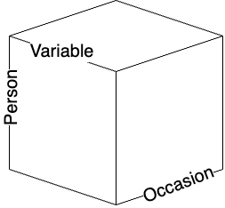
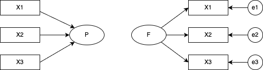
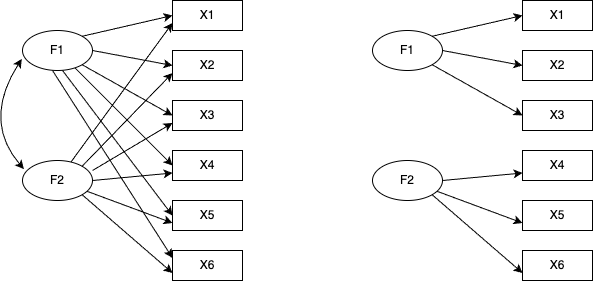

# Multivariate Analysis I

In this chapter we survey multivariate analysis with an emphasis on factor analysis — the technique most heavily used in psychological research.

## A comprehensive view of multivariate analysis
As the name suggests, multivariate analysis concerns datasets with many variables, and its principal aim is **information summarisation**. Interpreting each variable individually when many are present is laborious; a well-chosen summary buys considerable insight at modest cost.

From that aim several substantive interpretations follow. Below we list the main interpretive flavours and the analytic techniques that correspond to them.

+ **To summarise = to discard.** We use some of the information and set aside the rest.
+ **Reduce to a single composite variable.** A one-dimensional overall index (principal component analysis).
+ **Map to a few dimensions.** Visualise the data in a low-dimensional space (multidimensional scaling).
+ **Classify variables into a small number of groups.** Describe and analyse each group separately (cluster analysis).
+ **Reduce observed variables to a few latent variables.** Measure constructs and assign scores (factor analysis).
+ **Treat a binary observation as influenced by a single latent variable.** Tests with right/wrong outcomes (item response theory).
+ **Classify respondents from response patterns under a latent-variable assumption.** Finding hidden customer segments and the like (latent class analysis).
+ **Model structural relationships among latent variables as well.** Apply regression- and factor-analysis-style linear relationships to the data as a whole (structural equation modelling).
+ **Visualise the strength of variable-to-variable ties without assuming a latent variable.** Draw topological relationships with nodes and ties, or model the mathematical structure (network analysis).

The essential common feature is **discovering inter-variable relationships from data**. The relationships are expressed in different ways, with corresponding differences in technique. Most often we use covariances (correlations) as the measure of relationship; this presupposes data at the interval level or higher. For ordinal data, polychoric or polyserial correlations replace Pearson; for binary data, tetrachoric correlations.

Inter-variable relationships are not limited to correlations. For categorical variables one can use the **co-frequency** of joint category occurrence as the relational index. Co-frequency techniques include dual scaling [@Nishisato2010] (mathematically equivalent to correspondence analysis and Hayashi's Quantification Method Type III). Such categorical analyses are applied, for instance, in text mining of free responses after morphological analysis.

Relationships can also be expressed as **distances** (i.e., similarities) between variables. When the data satisfy the distance axioms, they can be visualised by multidimensional scaling [@Takane198002; @Okada19940115] or grouped by cluster analysis [@clusterAnalysis; @Adachi200607].

Correlation captures the strength of a straight-line relationship between two variables but can also reflect spurious associations driven by a hidden third variable. The **partial correlation** controls for surrounding variables; this is the foundation of graphical modelling [@Miyagawa1997] and network analysis [@Network2024].

In any case, given inter-variable relationships, an external criterion (if available) is fitted to estimate unknowns, and without one, the data are structured by model-based assumptions. The underlying goal is information summarisation, but some models emphasise visualisation, others the estimation of latent scores; each technique has its strengths and theoretical commitments.

Slightly off the main thread: linear algebra — the calculus of vectors and matrices — is the mathematical foundation underlying multivariate analysis. Its strength is to unify *computation* and *visualisation* under one perspective. Readers who want a deeper grip on multivariate analysis are encouraged to study linear algebra alongside.

### Cattell's data cube

R. B. Cattell drew a covariation chart — a **data cube** — to classify data. Any observation or measurement, he argued, can be specified by three attributes:

+ the **time** or **occasion** at which the observation is taken
+ the **variable** being observed
+ the **reference point** or **person** to which the variable is attached



In psychology a "dataset" is typically a two-dimensional matrix of persons × variables (a spreadsheet), but that is a slice through the cube along one time point. Other slices and other reorderings of the axes give six possible covariation cross-sections.

|                  | R | Q | O | P | S | T |
|------------------|---|---|---|---|---|---|
| Technique        | variable × person | person × person | occasion × occasion | person × occasion | occasion × variable | variable × occasion |
| Design           | variable × person | person × occasion | occasion × variable | variable × occasion | person × variable | occasion × person |
| Factor extracted | variable | person | occasion | person | occasion | variable |

Cattell classified the factor analyses on each cross-section as separate **techniques**. The familiar factor analysis — computing a variable-to-variable correlation matrix from variable × person data and extracting factors among the variables — is R-technique. Computing a person × person correlation matrix and extracting "person factors" is Q-technique. Slicing person × occasion gives O-technique (factors among occasions) and P-technique (factors among persons viewed from the occasion side). S- and T-techniques are analogously defined. S-technique applications are scarce; the others each have a small literature.

Inter-variable relationships can equally well be distance matrices (similarity matrices) or co-frequency relationships. One could classify variables or persons by cluster analysis on a distance matrix. The choice of cross-section and the choice of perspective are both free.

Generalising the three-dimensional restriction, more recent classifications use the data types present (**modes**) and the number of indexings (**ways**). For instance, mutual ratings among members within several groups have two modes (members and groups) with member × member relationships indexed over groups, giving 2-mode 3-way data. Family-systems research handles such data routinely.

Multivariate analysis, then, is a general toolkit asking which combination, which perspective, and which elements to summarise. The constraint "this cross-section is forbidden" does not arise; analysts visualise the whole and freely choose the meaningful cross-sections. Mathematically and statistically there are no model-level restrictions, and with packages such as R any of these analyses is feasible.

With this panoramic view, we turn to factor analysis — the technique psychology most embraces.


## Factor analysis

We outline **factor analysis**, one of psychology's most widely used techniques. Factor analysis is a statistical **model of measurement**. A related technique, **principal component analysis (PCA)**, is best described as a model of summarisation rather than measurement.

The factor model is

$$ z_{ij} = a_{j1}f_{i1} + a_{j2}f_{i2} + \cdots + a_{jm}f_{im} + d_j U_{ij}, $$

where $z_{ij}$ is the standardised score of person $i$ on item $j$; $a_{j\cdot}$ are the **factor loadings** of item $j$; $f_{i\cdot}$ are person $i$'s **factor scores**; $d_j$ is the unique-factor loading for item $j$; and $U_{ij}$ is the unique factor for person $i$ on item $j$. The $m$ factors carried by the $a_{j\cdot}$ are called **common factors**. Typically $m \ll M$, the number of items. The Big Five personality inventory has $M = 25$ and $m = 5$; the YG personality test has $M = 120$ and $m = 12$. Factor analysis is thus a model of information compression.

PCA, by contrast, can be written

$$ P_i = w_1 X_{i1} + w_2 X_{i2} + \cdots + w_M X_{iM}, $$

where $X_{i\cdot}$ is person $i$'s response on item $j$, and $P_i$ is the principal component formed as a weighted linear combination. The unknowns are the weights $w_j$, chosen to produce the most discriminating composite — i.e., the weights that maximise the variance of $P_i$. A single composite cannot in general capture all the information across $M$ variables, so further principal components are constructed in order.

What, then, distinguishes the $m$ common factors of factor analysis from $m$ principal components? Factor analysis is a measurement model: the data $z_{ij} = (X_{ij} - \bar{X}_j)/\sigma_j$ are assumed to contain measurement error $d_j U_{ij}$. PCA makes no such assumption and uses $X_{ij}$ directly.

In practice, responses that plausibly contain measurement error — e.g., psychological scale responses — call for factor analysis; quantities recorded without error — official records, accounting data — call for PCA. The historical spread of factor analysis through psychology and test theory, and of PCA through economics, commerce, and sociology, reflects this division.

Computationally the two share the use of eigenvalue decomposition to extract the most-explanatory components from an inter-variable relationship, so many software packages bundle them in the same menu, with different output styles. The design-level difference is nonetheless worth knowing. Factor analysis typically operates on a correlation matrix, PCA on a variance--covariance matrix; this reflects that psychological measurement is on a relative scale (more extraverted, more introverted), whereas other social-science quantities (trade surpluses, etc.) are absolute. PCA, aimed at compression, typically focuses on the first component; factor analysis, motivated by measurement theory, typically considers several factors. The choice between a single-factor and multi-factor view of intelligence in early intelligence testing reflects exactly this theoretical disagreement.

Similar techniques, different premises: knowing the background helps you pick the right tool.

### Exploratory factor analysis

When unqualified, "factor analysis" usually means **exploratory factor analysis (EFA)**. "Exploratory" reflects that neither the factor loadings nor even the number of common factors are fixed in advance; both are inferred from the data.

EFA proceeds in three steps:

1. Decide the number of factors.
2. Estimate the loadings (and rotate the factor axes).
3. Estimate factor scores.

Before any of this, you should have characterised the data with descriptive statistics and visualisation.

#### Determining the number of factors

Mathematically, factor analysis reduces to an eigenvalue decomposition of the correlation matrix $\mathbb{R}$ among the $M$ items. The default correlation is the Pearson product-moment; ordinal items call for polychoric correlations, binary items for tetrachoric correlations.

Eigenvalue decomposition exposes the dimensionality of the correlation matrix. Information in $M$ items occupies $M$ dimensions. With two variables $X, Y$, the data live in the 2-D space with $X$ and $Y$ as axes. If $X$ and $Y$ are correlated, an orthogonal $(X, Y)$ representation may not be the most efficient; a rotated basis with larger variance along one axis may be available. This is the common idea behind factor analysis and PCA: PCA focuses on the axis with the largest variance; factor analysis distinguishes the "useful dimensions" — the common factors — from the rest, which are absorbed into error.


The number of factors is chosen by the analyst, and the determination of "useful dimensions" has a subjective component. Many objective criteria have been proposed and are routinely used today, but treating mathematically extracted dimensions as substantive common factors is the analyst's responsibility.

A common rule for setting the number of factors is **parallel analysis** based on the scree plot. We illustrate with the `psych` package and its `bfi` sample data — five-item-per-factor measurements of the Big Five.

```{r parallel}
#| message: FALSE
pacman::p_load(tidyverse, psych)
dat <- psych::bfi |> select(-gender, -education, -age)
# parallel analysis
fa.parallel(dat)
```

A **scree plot** plots the eigenvalues from largest to smallest as a line graph. By default, both PC (principal-component) and FA (factor-analysis) scree plots are shown. The two differ in whether measurement error is assumed: factor analysis posits per-item error, so the per-item information is below 1 ($r_{jj} = 1 - h_j^2 = u^2 < 1$, with $h_j^2$ the communality — the sum of squared common-factor loadings — and $u_j^2$ the uniqueness). The FA curve therefore always lies below the PC curve.

The legend distinguishes **Actual Data**, **Simulated Data**, and **Resampled Data**. Real data have some semantic structure; their correlation matrix is unevenly distributed across dimensions, producing a gradually decaying scree curve. Simulated data are drawn from random numbers of the same size; resampled data are obtained by shuffling the original matrix. Neither carries semantic structure, so every dimension is uniformly uninformative, and the eigenvalues form a near-flat line. Parallel analysis compares the two: dimensions whose actual eigenvalue exceeds the flat line are meaningful. On this criterion, both the FA and PC solutions support six factors.

A horizontal line at eigenvalue 1 is also drawn, marking the older **Kaiser–Guttman criterion** that a factor must explain at least one variable's worth of variance to qualify as a common factor. By this rule three factors are warranted. Yet another rule of thumb is "what proportion of total variance is explained": if three factors capture less than 50%, that may be too much information discarded, and four or five factors might be retained instead.

#### Estimating factor loadings

Once the number of factors is set, we estimate the loadings. For instance:

```{r fa}
result.fa <- fa(dat, nfactors = 6, fm = "ML", rotate = "geominQ")
```

`psych::fa()` offers many options; here we specify the number of factors (`nfactors`), the estimation method (`fm`), and the rotation method (`rotate`).

For estimation we chose **maximum likelihood (`ML`)**. For samples of more than ~200, ML — assuming multivariate-normal data — is generally most appropriate. For small samples, the **least-squares family** (`ULS`, `OLS`, `WLS`, `GLS`, etc.) minimises the model–data discrepancy and is the safer choice. Without specification, **minimum residual (`minres`)** — the same as ULS in concept, but with an improved algorithm with better convergence — is the default. The principal-axis option (`pa`) corresponds to a model without estimated errors. The differences across algorithms are usually modest.

**Rotation** transforms the loadings to ease interpretation. Factor analysis and PCA identify new axes for the data, but those axes can be linearly transformed (rotated) about the origin to any orientation. In practice we want the orientation that is easiest to interpret. Mathematically, this is the rotation that yields **simple structure**: each item loads on one factor and minimally on the others. If items measuring Extraversion load heavily on the first factor, we prefer that they not also load on factors 2, 3, 4, and 5 — otherwise interpretation becomes a headache.

Within this guiding principle, many algorithms exist. The classical **varimax** rotation maximises the variance of squared loadings on each factor. Other choices include oblimin and geomin; for details see @kosugi2018.

Rotations split into **orthogonal** and **oblique**. Orthogonal rotations keep the rotated axes orthogonal — i.e., assume no inter-factor correlation. Oblique rotations allow inter-factor correlations. The latter is mathematically the weaker assumption, so a sensible workflow is to do oblique first and, if the inter-factor correlations are small, re-do orthogonal. Here we used `geominQ`, the oblique version of geomin.

The [@GPArotation] package implements many rotations selectable via `rotate`; consult its help.

There is no absolute standard for rotation either; algorithms reflect different premises. Unlike estimation, however, loadings can change appreciably under different rotations. Choose whichever rotation makes interpretation easiest, but be ready to explain — in your own words — what the rotation is and what it assumes.

#### Inspecting the output

```{r}
print(result.fa, sort = T, cut = 0.3)
```

We set `sort` (sort items by loading) and `cut` (suppress loadings smaller than 0.3 in the display). These are display options; the underlying $5 \times 25$ paths from each factor to each item are all computed.

The output starts with the loading matrix, the communality $h_j^2$, the uniqueness $u_j^2 = 1 - h_j^2$, and the complexity.[^1] These are the post-rotation **pattern matrix**. In an oblique rotation, the loadings split into the **pattern** (factor effects, projecting variables orthogonally onto an oblique factor system) and the **structure** (factor correlations: variable–factor simple correlations).

[^1]: Complexity is the index of how cleanly each item loads on a single factor: values near 1 mean the item loads essentially on one factor; larger values mean the item is spread across multiple factors. For loadings $a_{jk}$, complexity is $(\sum_k a_{jk}^2)^2 / \sum_k a_{jk}^4$.

Below the loadings, the sum of squared loadings (SS loadings) shows the variance explained by each factor; the proportions and cumulative proportions follow. Here the cumulative explained variance is 44%, meaning 56% of the information is discarded — from a compression standpoint, potentially too much.

Because the rotation is oblique, inter-factor correlations are reported next. The largest absolute correlation is −0.36. If all inter-factor correlations are within ±0.3, an orthogonal rotation can be considered.

Goodness-of-fit indices follow; we omit detailed discussion.

#### Factor-score estimation

So far we have estimated relationships between factors and items. In psychological research one is also interested in person-by-factor relationships: who is high on Extraversion, and what characterises low-Neuroticism individuals?

Mathematically, the eigenvalue decomposition that produces the loadings also produces eigenvectors; the per-person information has been summarised away by the time the correlation matrix is constructed. After the factor structure is fixed, we therefore back-compute the per-person scores: with the factor loadings known on the right-hand side of the factor model and the observed values on the left, we solve for the factor scores $f_{i\cdot}$.

`psych::fa()` returns factor scores by default:

```{r}
head(result.fa$scores, 10)
```

Some scores are `NA` (e.g., ID 61630): this happens when any response is missing.

```{r}
head(dat, 10)
```

Because factor scores are back-computed from the model, a single missing value blocks the calculation. The scores returned are standardised, hence unitless and only relatively comparable. Some authors argue against subsequent tests of mean differences on relative estimates of this kind.

In practice a simpler **simple-sum factor score** is widely used: identify the items associated with each factor and average their item-level responses. With our example, say the first factor reflects E2, E1, N4, E4, E5. Because E4 and E5 have negative loadings, their values are reverse-scored:

```{r}
Fscore1.raw <- dat |>
  # pick out the items relevant to the first factor
  select(E2, E1, N4, E4, E5) |>
  # reverse-score
  mutate(
    E4 = 7 - E4,
    E5 = 7 - E5
  )

# row-wise mean, ignoring missings
Fscore1 <- apply(Fscore1.raw, 1, function(x) mean(x, na.rm = TRUE))
summary(Fscore1)
```

Reverse-scoring is done by subtracting from 7 (for a 6-point scale starting at 1). The advantage is that the score retains its scale-anchored meaning (above the midpoint = agreement, below = disagreement) and is computable as long as some responses are present.

The drawbacks: it ignores the per-item weighting given by the loadings, and the error variance that factor analysis was supposed to remove is reintroduced. The scale items themselves should ideally have been constructed by proper scaling methods; in practice that rarely happens, and the simple-sum score is consequently a rough estimate.

Even so, simple-sum and model-based scores correlate very highly. If you can accept that psychological data are not so precise as to justify finer measurement, the simple sum is often enough.

```{r}
cor(result.fa$scores[, 1], Fscore1, use = "pairwise")
plot(result.fa$scores[, 1], Fscore1)
```

### Confirmatory factor analysis

So far we have discussed exploratory factor analysis. There the number of factors and the loadings are not specified a priori; the data speak, and interpretation is post hoc. In our example the first factor consists mainly of Extraversion items, but a Neuroticism item (N4) also slips in, complicating interpretation. The Big Five name implies five factors, yet the data prefer six.

Sometimes the theory is firmer than that: personality inventories have well-grounded structures, and one prefers to test a hypothesised structure. **Confirmatory factor analysis (CFA)** is the appropriate tool: factor structure is specified in advance and fitted to the data. CFA sits inside **structural equation modelling (SEM)**: the relationships between items and latent variables are expressed as equations and estimated.

SEM fits equations involving latent variables to a covariance/correlation structure. The relationships are often drawn as a **path diagram**: bidirectional arrows for correlations, unidirectional arrows for regressions, rectangles for observed variables, ovals for latent variables. The diagram makes the difference between factor analysis and PCA stark:



And between EFA and CFA:



In CFA, each factor's effect on each item is specified individually — equivalently, the paths assumed absent are fixed to zero. The figure assumes zero inter-factor correlations, which is why no path is drawn between the factors (correlations *can* of course be drawn).

The model comes first; the covariance matrix implied by the model is fit to the observed covariance matrix. Estimation methods include OLS, ML, and Bayesian methods; in practice you should know the algorithm name as well. Post-estimation you assess **goodness of fit**, with several indices considered together.

A worked example in R, using the **`lavaan`** package.[^2] Specify a CFA model[^3]:

[^2]: An idiosyncratic name; "lavaan" stands for *LAtent VAriable ANalysis*.

[^3]: The `lavaangui` package lets you specify models via a GUI.

```{r}
pacman::p_load(lavaan)
# model specification
model <- "
Neuroticism =~ N1 + N2 + N3 + N4 + N5
Agreeableness =~ A1 + A2 + A3 + A4 + A5
Extraversion =~ E1 + E2 + E3 + E4 + E5
Openness =~ O1 + O2 + O3 + O4 + O5
Conscientiousness =~ C1 + C2 + C3 + C4 + C5
"
```

Note that the model is a string in quotes. Latent variables go on the left, indicators on the right, connected by `=~` (the **measurement equation**). Correlations use `~~`; regressions use `~`. Equations between latent variables are called **structural equations**.

No inter-factor correlations are specified; by default a covariance between any two latent variables not declared zero is freely estimated. To force a zero, write `Neuroticism ~~ 0 * Openness`.

With the model specified, fit it. We use ML and request fit measures and standardised coefficients in the summary:
```{r}
# model estimation
model.fit <- sem(model, estimator = "ML", data = dat)
summary(model.fit, fit.measures = TRUE, standardized = TRUE)
```

The output begins with a model summary (estimator, etc.) and then a battery of fit indices (CFI, TLI, AIC, BIC, RMSEA, SRMR, …). These fall into three categories:

First, **comparative indices** anchored at a null model (worst possible) of 0 and a saturated model (perfect fit) of 1 — CFI and TLI fall here. The saturated model fits the data perfectly with all possible paths; the null (independence) model assumes no inter-variable association whatsoever and is the most constrained.

Second, **likelihood-based relative indices** — AIC, BIC, SABIC. The likelihood expresses how close the model's distribution is to the data, so it is meaningful only for comparing models on the same data. AIC (Akaike Information Criterion) combines $-2$ log-likelihood with the number of parameters: $-2\text{LL} + 2p$. Smaller is better. BIC (Bayesian Information Criterion) penalises parameters more heavily, scaled by the sample size. SABIC is a sample-size-adjusted variant.

Third, **residual-based indices** — RMSEA, SRMR. RMSEA (Root Mean Square Error of Approximation) targets the model's approximation error; values below 0.05 are conventionally "good." SRMR (Standardised Root Mean Square Residual) is the standardised root mean square of the residuals between observed and model-implied data; values below 0.08 are "good."

When evaluating model fit, look at several indices together rather than rely on any single one.

Below the fit indices come the estimates and test statistics. In psychology, the column most often consulted is `Std.all`, with all variables standardised.[^4] Small or non-significant path coefficients can be dropped to improve fit — but improving fit should not be a research goal. If conventional thresholds cannot be met, revisit the assumptions; adding paths inconsistent with theory just to push fit up is the same kind of QRP as "engineering significance."

[^4]: `Std.all` standardises both observed and latent variables to unit variance; `Std.lv` standardises only the latent variables.

Packages also automate path-diagram drawing. Several exist (`lavaanExtra`, `tidySEM`, `lavaanPlot`, `lavaanPlot2`); we illustrate with the classical `semPlot`:
```{r}
pacman::p_load(semPlot)
semPaths(model.fit, what = "stand", style = "lisrel")
```

That concludes the overview of factor analysis.

Factor analysis is a model of measurement and is heavily used when designing psychological scales. But because it identifies common dimensions from inter-item correlations, neither "the construct has been measured directly" nor "the existence of the construct has been demonstrated" follows. For example, write items about ramen and have respondents rate them quantitatively, and you can extract a "ramen factor" or a "tonkotsu factor" with some interpretive content. That does not mean people have internalised a psychological "tonkotsu factor."

SEM can specify regression or correlation paths between latent variables, but it pays to think about how those relationships actually manifest. Even a strongly fitting model with strong cross-factor influence may have small measurement-model coefficients: ask what concretely changes when a factor score increases by one unit, and how that shows up in behaviour or measurement. A statistically valid but substantively meaningless model is a paper exercise.

Issues of measurement and substantive impact run in parallel between factor analysis and item response theory (a relative of factor analysis), to which we now turn.

### SEM applications

SEM is not confined to confirmatory factor analysis; it provides a flexible vocabulary for structural relationships between latent variables and so supports several useful extensions.

#### Mediation analysis

<!-- TODO: cover mediation analysis. Direct, indirect, and total effects;
the limitations of the classical Sobel test and the use of the bootstrap
sampling distribution for interval estimation; lavaan's `a*b` notation
and the `:=` syntax for derived parameters; correspondence with Hayes's
PROCESS macros. -->

#### Multi-group SEM

<!-- TODO: cover multi-group SEM (measurement invariance). The four levels
of measurement invariance (configural, metric/weak, scalar/strong,
strict); lavaan's `group = "..."` and `group.equal = c("loadings",
"intercepts")`; nested model comparison via ΔCFI and ΔRMSEA; applications
in cross-cultural research and scale translation. -->

#### Latent growth curve models

<!-- TODO: cover latent growth curve models. Modelling within-individual
change in longitudinal data; the parameterisation in which random
intercepts and slopes are treated as latent variables; linear vs.
non-linear growth; equivalence to the HLM (GLMM) of Chapter 14 and the
contrast in perspective. -->

## Item response theory {#sec-irt-model}

Next, **item response theory (IRT)**. Sometimes called *modern test theory* in contrast to classical test theory (CTT), IRT is grounded in test theory and so assumes a binary outcome (0 = incorrect, 1 = correct). It can also be viewed as factor analysis with a binary indicator, and its mathematical equivalence to categorical factor analysis is established.

A further difference from factor analysis: factor analysis (rooted in personality psychology) emphasises exploring factor structure, while IRT (rooted in test theory) emphasises refining factor-score estimation. In personality psychology the number of factors is itself a research question; in test theory a single-factor "ability" structure is preferred. This is why scale construction via factor analysis cultivates "simple structure" and prunes items, while IRT — given a sufficiently large first-factor loading (around 30% variance is typical) — treats the data as essentially unidimensional and pools items rather than discarding them.

**Computer adaptive testing (CAT)** is the leading current application of IRT: items are served dynamically from a pool based on the respondent's pattern of correct/incorrect answers, efficiently estimating the latent ability. CAT requires an IRT-based model, an item pool calibrated for various ability levels, and a database-and-delivery system tying them together.[^5]

[^5]: Japan's national university-entrance examinations briefly considered CAT but rejected it: the need for a huge item pool (requiring extensive pre-testing) and the difficulty of providing the same network and operating environment at remote and island sites as in urban areas made it impractical. The existing paper-and-pencil (mark-sheet) system runs an extraordinary error rate below one percent even with 500,000 simultaneous test-takers each year; given its social impact, CAT adoption demands extreme caution.

### Logistic models

IRT is a single-factor model for binary data. Because of the binary outcome, dimensional analysis uses tetrachoric correlations rather than Pearson's. Modelling treats item responses as regressed on a person parameter $\theta$ that corresponds to the factor — a logistic-regression-like setup.

The person parameter is assumed standard normal; expressed via the normal CDF, this is well approximated by a logistic curve, and the linear placement of item parameters fits naturally inside a logistic model.[^6] The standard normal density, its CDF, and a logistic approximation thereof are plotted below. The logistic model conventionally uses the constant 1.702 in the exponent to better approximate the normal CDF:

$$ f(x) = \frac{1}{1 + \exp(-1.702 x)}. $$


[^6]: It is also possible, of course, to model with the normal CDF directly.

```{r logistic_curve}
#| message: FALSE
#| dev: "ragg_png"
pacman::p_load(ggplot2, patchwork)

x <- seq(-4, 4, length.out = 1000)
normal_df <- data.frame(
  x = x,
  density = dnorm(x),
  cdf = pnorm(x),
  logistic = 1 / (1 + exp(-1.702 * x))
)

# 1. standard normal density
p1 <- ggplot(normal_df, aes(x = x, y = density)) +
  geom_line() +
  labs(title = "Standard normal density", x = "x", y = "density") +
  theme_minimal()

# 2. standard normal CDF
p2 <- ggplot(normal_df, aes(x = x, y = cdf)) +
  geom_line() +
  labs(title = "Standard normal CDF", x = "x", y = "cumulative probability") +
  theme_minimal()

# 3. logistic approximation
p3 <- ggplot(normal_df, aes(x = x, y = logistic)) +
  geom_line() +
  labs(title = "Logistic approximation", x = "x", y = "probability") +
  theme_minimal()

p1 + p2 + p3
```


Using this logistic function we now characterise items via item parameters. IRT logistic models come with various numbers of parameters, with the more elaborate ones containing the simpler as special cases.

#### 1PL model

The one-parameter logistic (1PL) model has a single item parameter $b$:

$$ P(Y_{ij} = 1 \mid \theta_i, b_j) = \frac{1}{1 + \exp(-1.702 (\theta_i - b_j))}. $$

$Y_{ij}$ is the binary indicator of correctness for person $i$ on item $j$; $\theta_i$ is the person's ability; $b_j$ is the item's **difficulty**. Larger $b_j$ shifts the curve to the right (so the same probability of correct response requires higher ability), and smaller $b_j$ shifts it left.

```{r 1PLmodel}
#| dev: "ragg_png"
logistic_1pl <- function(theta, b) {
  1 / (1 + exp(-1.702 * (theta - b)))
}

x <- seq(-4, 4, length.out = 1000)
normal_df <- data.frame(
  x = x,
  default = logistic_1pl(x, 0),
  easy = logistic_1pl(x, -1),
  hard = logistic_1pl(x, 1)
)

ggplot(normal_df) +
  geom_line(aes(x = x, y = default, color = "default (b=0)")) +
  geom_line(aes(x = x, y = easy, color = "easy (b=-1)")) +
  geom_line(aes(x = x, y = hard, color = "hard (b=1)")) +
  scale_color_brewer(palette = "Set2") +
  labs(
    title = "1PL logistic model",
    x = "theta",
    y = "P(correct)",
    color = "difficulty"
  ) +
  theme_minimal() +
  theme(legend.position = "bottom")
```

#### 2PL model

The 2PL model adds an item parameter $a_j$ — the **discrimination**:

$$ P(Y_{ij} = 1 \mid \theta_i, a_j, b_j) = \frac{1}{1 + \exp(-1.702 a_j (\theta_i - b_j))}. $$

It is called the discrimination parameter because it controls the slope of the logistic curve. A steep slope means a sharp transition from incorrect to correct around a particular $\theta$; a shallow slope means the item only weakly distinguishes ability levels. In categorical factor analysis, $b_j$ corresponds to a threshold and $a_j$ to a loading.

```{r 2PLmodel}
#| dev: "ragg_png"
logistic_2pl <- function(theta, a, b) {
  1 / (1 + exp(-1.702 * a * (theta - b)))
}

x <- seq(-4, 4, length.out = 1000)
normal_df <- data.frame(
  x = x,
  default = logistic_2pl(x, 1, 0),
  easy = logistic_2pl(x, 1.5, -1),
  hard = logistic_2pl(x, 0.5, 1)
)

ggplot(normal_df) +
  geom_line(aes(x = x, y = default, color = "default (b=0, a=1)")) +
  geom_line(aes(x = x, y = easy, color = "b=-1, a=1.5")) +
  geom_line(aes(x = x, y = hard, color = "b=1, a=0.5")) +
  scale_color_brewer(palette = "Set2") +
  labs(
    title = "2PL logistic model",
    x = "theta",
    y = "P(correct)",
    color = "model and settings"
  ) +
  theme_minimal() +
  theme(legend.position = "bottom")
```

#### 3PL, 4PL, 5PL models

In practice the 2PL is the most common, but 3PL, 4PL, and 5PL models exist:

$$ P(Y_{ij} = 1 \mid \theta_i, a_j, b_j, c_j) = c_j + \frac{1 - c_j}{1 + \exp(-1.702 a_j (\theta_i - b_j))}, $$

$$ P(Y_{ij} = 1 \mid \theta_i, a_j, b_j, c_j, d_j) = c_j + \frac{d_j - c_j}{1 + \exp(-1.702 a_j (\theta_i - b_j))}, $$


$$ P(Y_{ij} = 1 \mid \theta_i, a_j, b_j, c_j, d_j, e_j) = c_j + \frac{d_j - c_j}{\{1 + \exp(-1.702 a_j (\theta_i - b_j))\}^{e_j}}. $$


$c_j$ is the **lower-asymptote** parameter (guessing), $d_j$ the **upper-asymptote** parameter, and $e_j$ the **asymmetry** parameter. More parameters demand larger samples for estimation and complicate operational use (e.g., equating across forms), so these are not widely used.

#### Practical fitting

The logistic curve characterising an item is the **item response function (IRF)** or **item characteristic curve (ICC)**. Several R packages fit IRT models — `ltm`, `exametrika`, and others. We use the author's own `exametrika` package and its sample data. `J15S500` is data from 500 respondents answering 15 items.

```{r}
#| message: FALSE
pacman::p_load(exametrika)
result.2pl <- IRT(J15S500, model = 2, verbose = FALSE)
print(result.2pl)
```

Numerically, the `Item Parameters` block reports the slope (discrimination) and the location (difficulty) with their standard errors. `Item Fit Indices` gives per-item fit; `Model Fit Indices` gives test-level fit. Viewed through the lens of SEM fit indices, IRT models tend to fit poorly — a price of modelling binary data, in part.

IRT's strength is less in the numerical fit and more in the ease of visualising items. `exametrika::plot()` draws the IRFs:

```{r}
plot(result.2pl, item = 1:5, type = "IRF", overlay = TRUE)
```

Summing the IRFs across the whole test gives the **test response function (TRF)**:

```{r}
plot(result.2pl, type = "TRF")
```

A transformation of the IRF yields the **item information function (IIF)**. The IIF peaks where the variance is greatest — at $P = 0.5$ — and is defined by

$$ I_j(\theta) = \frac{P_j^{\prime}(\theta)^2}{P_j(\theta)\bigl(1 - P_j(\theta)\bigr)}. $$

Roughly, the larger the gap between correct- and incorrect-response probabilities, the more information the item carries. Plot with `type = "IIF"`:

```{r}
plot(result.2pl, item = 4, type = "IRF")
plot(result.2pl, item = 4, type = "IIF")
```

The IIF encodes IRT's notion of reliability: reliability is a function of $\theta$, telling us where in the ability range the item works most efficiently.

For contrast, classical test theory expresses reliability as the proportion of true-score variance in the overall test; factor analysis expresses it via item-level communality $h_j^2$. CTT goes from the test to the items; modern test theory goes the other way and evaluates per-function, per-item performance.

In IRT, even items that are too easy or too hard are not deleted: they are needed to assess high- or low-ability respondents. Such items will not contribute much variance, and may have low communalities, but they are kept — a philosophical contrast with the factor-analytic approach.

The whole-test information function is the sum of per-item IIFs. Use `type = "TIF"`:

```{r}
plot(result.2pl, type = "TIF")
```

This 15-item test peaks near $\theta = -1$ — it offers its sharpest measurement for respondents of somewhat-below-average ability. When item parameters are known for a large pool, IRT lets the test designer engineer the precision in advance by selecting items.

The person parameter $\theta$ is estimated from the response pattern. A standard-normal prior with Bayesian estimation is typical.[^7] `exametrika` returns these along with the item parameters:

```{r theta estimation}
head(result.2pl$ability)
```


[^7]: With MLE, a respondent who gets everything right or everything wrong has an infinite $\theta$ estimate — not practically useful.

### IRT extensions

IRT is fundamentally for binary data, but models for graded and multi-category responses exist. For Likert-style multi-step responses, the **graded response model (GRM)** and the **partial credit model (PCM)** are common. These let one assume an ordinal level of measurement on psychological-scale data.

Psychological scales' Likert-style responses are typically thought to support, at best, ordinal-level measurement, yet they have long been treated as interval-level for mathematical convenience (and for the unflattering reason that anything more careful was thought unwarranted). One reason this "treat as interval" practice persisted was that GRM/PCM were unavailable in mainstream packages. Today the mathematical equivalence of GRM and the 2PL means common software (e.g., Mplus) can estimate them as the same latent-variable model, and R packages such as `ltm` provide GRM and PCM. "We don't have the tools" is no longer a valid excuse.

A further advantage of graded-response modelling is in choosing the right number of response categories. Five-point and seven-point Likert items are common conventions but lack any theoretical justification; the more important question is whether respondents can actually discriminate between 5 or 7 categories.[^8]

[^8]: Frequently asked: "If the prior literature uses 5 points, do we have to?" and "Can we mix 5-point and 7-point scales?" The correct answers: if you are using the prior literature's scoring or standardisation, follow the prior literature; otherwise (e.g., when running EFA and setting your own loadings), design the scale around what respondents can actually distinguish. If you do not know in advance, use a graded-response IRT model to check responses to each category.

A concrete example using `ltm::grm()` on the `Science` dataset — science-attitude items on a 4-point scale.

```{r grm}
#| message: FALSE
pacman::p_load(ltm)
data(Science)
result.grm <- grm(Science)
print(result.grm)
```

The output reports three thresholds (Extrmt) and the corresponding discrimination (Dscrmn). Like the logistic model, GRM admits IRF/IIF/TIF plots; we draw the IRF (called `ICC` in `ltm`):

```{r grm plot1}
plot(result.grm, items = 2, type = "ICC")
```

Each category's response probability is plotted as a function of $\theta$. As $\theta$ rises, the modal category shifts from 1 to 2 to 3, in order.

The next item, however, looks different:
```{r grm plot2}
plot(result.grm, items = 1, type = "ICC")
```

Categories 1 and 2 never become the modal response; nearly the whole range is dominated by category 3, with category 4 only beginning to appear above $\theta = 3$. The plot spans $-4 \leq \theta \leq +4$; expanding the negative side might recover category-1 and -2 modes, but that is not realistic. Some items have no clear category modes, suggesting that the response scale was poorly designed.

The IRT approach is increasingly recommended for designing psychological scales. The single-factor assumption can also be relaxed; **multidimensional IRT** models exist (the `mirt` package provides them). There is no longer a reason not to use the IRT approach.

## Summary

We have covered the basics and the practice of exploratory factor analysis, confirmatory factor analysis (under SEM), and item response theory.

Their common thread is constructing measurement models with latent variables, grounded in covariance or correlation matrices. With tetrachoric/polychoric/polyserial correlations for ordinal scales, the analysis becomes a categorical factor analysis — which is also a (graded) IRT model. Software capable of computing correlations appropriate to the level of measurement can run these models with the same workflow (`lavaan` lets you set the scale level of each variable; Mplus is also well known for this).

Knowing the historical roots and theoretical lineage of each model informs its application, but as a user one should use whichever tool fits the task. Design research with the *respondent* in mind. Letting mathematical limitations, software constraints, or — worst of all — a researcher's incomprehension or laziness force respondents into ill-fitting designs degrades the quality of the data.

## Exercises

Practise the multivariate techniques of this chapter on the following problems, which aim to deepen understanding through hands-on analysis. As an example we use `psych::small.msq` — the Motivational State Questionnaire — a 14-variable, 200-case dataset.[^9]

Its 14 variables comprise energetic arousal (`active`, `alert`, `arousal`, `sleepy`, `tired`, `drowsy`), tense arousal (`anxious`, `jittery`, `nervous`, `calm`, `relaxed`, `at.ease`), plus `gender` and `drug` (a drug-condition factor). Excluding `gender` and `drug`, the structure is presumed two-factor.

[^9]: A subset of the more than 2,500 sample MSQ; the full data are in the `psychTools` package.

```{r}
#| include: FALSE
#| echo: FALSE
#| eval: FALSE
# setup
pacman::p_load(psych, tidyverse)
data(small.msq)
summary(small.msq)

dat <- small.msq %>% select(-gender, -drug)
```


### Exercise 1: exploratory factor analysis

Perform an exploratory factor analysis.

Steps:

1. Decide the number of factors.
2. Fit the factor model (oblique rotation).
3. Interpret the results (factor loadings, communalities, uniquenesses).

```{r EFA practice}
#| include: FALSE
#| echo: FALSE
#| eval: FALSE
fa.parallel(dat, cor = "poly")
result <- fa(dat, cor = "poly", nfactors = 2, rotate = "geominQ")
print(result, sort = T, cut = 0.3)
```

### Exercise 2: confirmatory factor analysis

Fit a two-factor model with `lavaan`. Use `ordered = TRUE` in the model specification to treat the indicators as ordinal.

Steps:

1. Build the theoretical model (draw a path diagram).
2. Fit with `lavaan`.
3. Plot.
4. Evaluate fit indices.
5. Modify the model if needed.

```{r cfa practice}
#| include: FALSE
#| echo: FALSE
#| eval: FALSE
pacman::p_load(lavaan)
model <- "
f1 =~ active + alert + aroused + sleepy + tired + drowsy
f2 =~ anxious + jittery + nervous + calm + relaxed + at.ease
"
result.sem <- sem(model,
  data = dat,
  ordered = TRUE
)
summary(result.sem, fit.measures = TRUE, standardized = TRUE)

pacman::p_load(lavaanPlot)
lavaanPlot(result.sem)
```

### Exercise 3: graded response model

Apply `ltm`'s GRM. Because GRM assumes unidimensionality, split the data into the energetic-arousal and tense-arousal item sets and fit a GRM to each.


Steps:

1. Split the data.
2. Fit a GRM.
3. Plot ICCs.
4. Plot IIFs.

```{r grm practice}
#| include: FALSE
#| echo: FALSE
#| eval: FALSE
pacman::p_load(ltm)
EA <- dat %>% dplyr::select(active, alert, aroused, sleepy, tired, drowsy)
TA <- dat %>% dplyr::select(anxious, jittery, nervous, calm, relaxed, at.ease)

result.EA <- grm(EA)
plot(result.EA, type = "ICC")
result.TA <- grm(TA)
plot(result.TA, type = "ICC")
```

### Exercise 4: multidimensional graded IRT

Use `mirt` (multidimensional IRT) to fit a two-factor graded model:

```{r mirt example}
#| eval: false
pacman::p_load(mirt)
# two factors, graded response
result.mirt <- mirt(dat, model = 2, itemtype = "graded")
# oblique rotation in the summary
summary(result.mirt, rotate = "geominQ")

# multidimensional ICC
plot(result.mirt, type = "trace", which.items = 1)
# multidimensional information
plot(result.mirt, type = "info")
```
